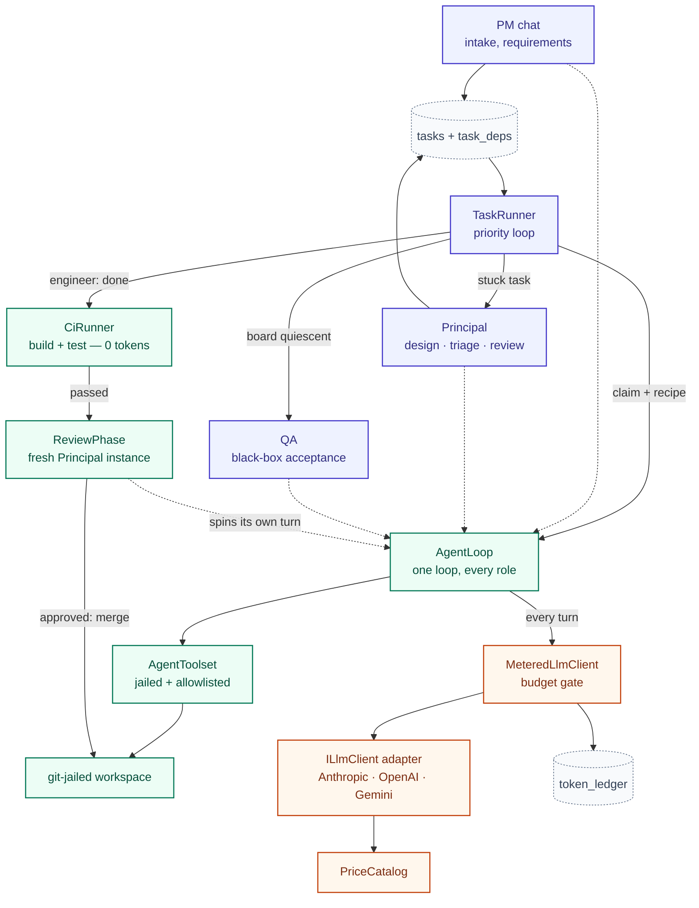
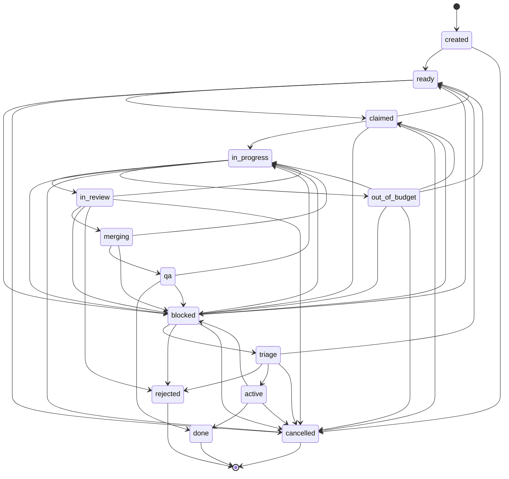

# Architecture

This document explains how Forge's harness actually executes — the agent loop,
the task state machine and its triage logic, how multiple LLM providers are
normalised behind one interface, and the budget guardrails that keep an
autonomous build from running away with a client's money. It complements
`ORCHESTRATOR-SPEC.md` (the design rationale) and `CLAUDE.md` (decisions made
while building); this file is the "how the code actually works" tour, with
class names and file paths.

Two layers, one process:

- **Orchestrator** — the scheduler, the task DAG, the PM/Principal/Engineer/QA
  roles, the board.
- **Harness** — the deterministic machine wrapped around every LLM call inside
  that: assemble context → call the model → parse tool calls → execute them
  jailed → feed back observations → enforce budget/iteration caps → persist
  the ledger and a progress note. Everything in the harness is trusted
  mechanical code; everything the model produces is untrusted output under
  supervision. The whole point of the architecture below is keeping that line
  sharp — the model proposes, the harness decides.

### System diagram

Every orchestrator phase — PM chat, Principal design/triage/review, QA — is a
different *caller*, but they all converge on the same `AgentLoop`, the same
metering gate, and the same provider adapters. Only the engineer's path runs
through the CI → review → merge gate before its work reaches trunk.



Solid arrows are the control flow a task actually walks; dotted arrows mark
every place a phase hands its opening turn to the *same* `AgentLoop` rather
than running its own bespoke machinery. Everything downstream of "every turn"
is identical no matter which box put it there — one metering gate, one ledger,
one set of provider adapters, regardless of role.

---

## 1. The agent loop (`Agents/AgentLoop.cs`)

Every role — Engineer, Principal, PM, QA, reviewer — runs through the exact
same loop. There is no per-role loop implementation; only the recipe (model
tier, prompt, tool allowlist, path scope) differs. `AgentLoop.RunAsync` is
seeded four ways (`RunAsync` for a task packet, `RunTriageAsync` for a
just-in-time triage briefing, `RunReviewAsync` for a diff, `RunChatAsync` for
a conversation), but all four converge on one turn loop:

```
for turn in 1..IterationCap:
    response = llm.CompleteAsync(system, conversation)   # MeteredLlmClient underneath
    conversation += assistant(response)
    calls = ToolCallParser.Parse(response.Content)
    if calls.isEmpty:
        nudge "no tool call" (3 strikes -> Crash)
        continue
    for call in calls:
        outcome = toolset.ExecuteAsync(call)              # jailed, allowlisted
        observations += outcome
        if outcome.End is set: break                       # an ending tool ends the turn
    if ended: return Finish(...)
    inject pending messages (e.g. a budget nudge) + iteration nudge
    conversation += user(observations)
return Finish(Iterations)                                   # cap reached, no ending call
```

Points worth knowing if you're reading or extending this:

- **The model is resolved once per instance**, not per turn (`llm.ModelFor(recipe.Tier)`
  before the loop starts) — a conversation must not change models underneath itself.
- **An ending tool call terminates the turn immediately**, even mid-batch: if a model
  emits `[read_file, done]` in one turn, `done` ends it and anything after is moot.
- **Every provider failure becomes one of three outcomes**, decided once, at the call
  site: `BudgetExhaustedException` → `EndReason.Budget` (the loop's only job is to
  report which budget — task or project — refused it); any other exception (auth
  failure, rate limit, or an HTTP timeout, which surfaces as a `TaskCanceledException`
  even though nothing was cancelled) → `EndReason.Crash`; genuine cancellation
  (`OperationCanceledException` when *our* token tripped) propagates and actually
  stops the run. A crash never kills the process — it ends the instance with the
  workspace and a progress note intact, so a fresh instance resumes.
- **Three empty turns in a row is also a crash** (`MaxEmptyTurns`) — a model that stops
  emitting tool calls is not doing anything, and the loop says so rather than idling.
- **Two independent nudges keep a model from running off the end of its budget blind**:
  `MeteredLlmClient` injects a message when token spend crosses 70% of the task
  budget (see §4); `AgentLoop.AppendIterationNudge` does the equivalent for *turns*,
  since token spend and turn count are counted by different owners. Both fire at the
  same 70% threshold so a run low on tokens and a run low on turns feel the same to
  the model, and the loop fires a second, harder nudge on the literal last turn
  ("this is your last turn, call `done`/`progress_note`/`escalate` now") — added
  after a real run spent its final turns exploring instead of declaring a finished
  scaffold, stranding it in `blocked` for no reason.
- **A progress note always exists on exit**, even if the model never wrote one: if the
  instance dies mid-run, `Finish` synthesizes one from the model's last message
  (`ProgressStatus [ended crash after N turns]: ...`). The resume path depends on a
  note existing, so it cannot be left to the model's discretion — the harness
  guarantees it mechanically.

### Prompt architecture

The system prompt is assembled from three layers, never stored as a blob on the
task row (`Agents/PromptAssembler.cs`):

| Layer | Source | Scope |
|---|---|---|
| **A — role identity** | `prompts/roles/<role>.md`, versioned in git | every turn for that role |
| **B — task-type rules** | `prompts/tasks/<type>.md` (task/bug/chore) | task work only, not chat |
| **C — the task packet** | columns on the `tasks` row (objective, acceptance criteria, context paths) | rendered to markdown at spin-up, never written to disk |

A fourth block, the **tool protocol**, is generated from `recipe.Tools` rather
than hand-written prose (`PromptAssembler.ToolProtocol`) — the documented tool
surface literally cannot drift from the executable one, because both come from
the same list. The practical payoff: fixing a bug in `prompts/roles/engineer.md`
improves every future engineer task without touching code, and a role can never
be told about a tool it doesn't actually have.

---

## 2. The task state machine and triage logic

### The state machine (`Model/TaskRecord.cs` — `TaskTransitions`)

Every status change goes through one legal-transition map; there is no raw
`UPDATE tasks SET status = ?` anywhere in the harness. `TaskTransitions.Legal`
is the whole map, drawn exactly as coded (every arrow below is a real,
reachable transition — nothing is simplified for the picture):



The density around `blocked` and `out_of_budget` is not an accident of the
diagram — it's the real shape of the Principal's triage ladder (§2 below):
those two states have more outbound edges than any other because they're
where a stuck task can be redirected, escalated, split, or taken over, and
the map has to legalize every one of those exits.

**Routing is derived, never stored.** `TaskTransitions.RoleFor(status)` is a
static map from status to the role that owns it (`in_review` → Principal,
`qa` → Qa, `blocked`/`out_of_budget`/`triage` → Principal, `created` → PM).
There is deliberately no "next actor" column — that would be a second source
of truth that could drift from status, so "who acts next" is always a pure
function of where the task sits.

### The priority loop (`Scheduling/TaskRunner.RunNextByPriorityAsync`)

One call, three tiers of priority, run every time `forge run --loop` ticks:

1. **A Principal-owned stuck task first** (`NextPrincipalOwned` — anything
   `blocked`, `out_of_budget`, or `triage`). Stuck tasks usually gate the rest
   of the DAG, so they're cleared before new work advances.
2. **Otherwise, the next claimable engineer task** (`ready` with no unmet
   dependency, or a resumable `in_progress`/`claimed` task — resumption is
   checked *before* new claims, because a task left `in_progress` means its
   worker was killed and its workspace is still on disk; picking up new work
   while abandoned work sits there is how a queue leaks tasks).
3. **Otherwise, close any `active` Feature whose children are all terminal**
   (this is what makes the board quiescent) **and run QA** if the board is
   done and there's new work to verify.

### Triage: the two-strike ladder (`TaskRunner.TriageOrImplementAsync`)

A task lands here when it's `blocked` or `out_of_budget`. What happens depends
on its status and its strike count (`OutOfBudgetCount`):

- **`triage` status, type `Feature`** → `DecomposeFeatureAsync`: a fresh
  Principal instance runs the design phase (greenfield or change-request
  brief, whichever applies) and the harness back-fills `parent_id` and
  milestone on every task it creates, then releases them (`created` → `ready`).
- **`triage` status, type `Bug`** → `TriageBugAsync`: the Principal reads the
  bug and the requirement it cites and calls `accept_bug` (→ `ready`) or
  `reject_bug(reason)` (→ `rejected`, permanent — never re-filed).
- **`out_of_budget`, strike count ≥ `DirectImplementStrike` (2)** →
  `ImplementDirectlyAsync`: redirecting twice didn't land it, so the Principal
  implements the task itself with a fresh budget, through the *same* CI +
  review + merge gate as an engineer — being the Principal buys no exemption
  from verification.
- **`out_of_budget`, strike count > 2, or anything else unresolved** →
  `GiveUp`: transition to `blocked` and escalate to the PM. The autonomous
  loop never spins forever on one task.
- **Otherwise (a plain `blocked` task, or the first `out_of_budget` strike)**
  → `TriageAsync`: a fresh Principal instance reads the stuck task's workspace
  and progress note (a just-in-time packet built by `TriagePacket`, not baked
  into the role prompt) and ends its turn with exactly one of: `redirect`
  (concrete guidance, optionally a raised budget, back to the engineer),
  `create_task` + `add_dependency` (split it up, then redirect what remains),
  or `escalate` (a requirements question only the client can answer).

Any subtasks a triage or decomposition creates are otherwise stranded —
`created` has no automatic release path outside these two flows — so the
harness always back-fills `parent_id`, inherits the parent's milestone, and
flips them to `ready` in the same step that creates them
(`ReleaseTriageSubtasks`). Skipping this once literally deadlocked a board
with unclaimable work.

### Integration: CI, review, merge (`TaskRunner.IntegrateAsync`)

When an engineer instance ends `Done`, nothing is trusted until it's checked
against ground truth:

1. **Commit + push.** If there are no commits ahead of the branch, that's a
   `blocked` task with an escalation — "done" with nothing to show for it is
   not a valid end state.
2. **CI, harness-run, zero tokens** (`Ci/CiRunner.cs`): `dotnet build` then
   `dotnet test` in the task's own workspace — trusted mechanical code, not
   the agent's jailed executor, and not an LLM call. No `.sln`/`.csproj` found
   is a *skip*, not a failure (docs-only tasks, or a project not yet
   scaffolded). CI failure short-circuits straight back to the engineer with
   the compiler/test output as feedback — **the Principal never reviews code
   that fails to build.**
3. **Review, a fresh Principal instance** (reviewer ≠ author), seeded with the
   branch diff. Ends in `approve` (→ merge to trunk) or `request_changes`
   (→ back to `in_progress`, feedback lands in the progress note so the next
   instance's packet already contains it — the identical mechanism a killed
   process resumes through). A `request_changes` may also carry a
   `convention`, appended to `CONVENTIONS.md` on trunk — a recurring mistake
   is ruled out once, for every future engineer, not caught repeatedly.
   Reviewing a *bug-fix* branch has a third outcome, `reject_bug`: if the
   review shows the reported defect isn't real, the bug closes (`rejected`)
   instead of looping `request_changes` forever on a fix for something that
   was never broken.
4. **Merge to trunk**, then `Qa`/`Done`. The revision loop is bounded
   (`RevisionCap`, 5 engineer attempts counted from `agent_instances` — only
   attempts that reached CI+review and were sent back count, not
   budget/crash kills) — past that, the task blocks and escalates rather than
   cycling forever.

Any exception during this sequence (a git failure, a review crash) is caught
and parks the task as `blocked` with the branch and workspace intact, rather
than stranding it in a state nothing will ever claim.

### QA and bugs: the project-level acceptance gate

QA is **project-level, not per-task** — a half-built feature has no observable
behaviour to black-box test. `MaybeRunQaAsync` runs only once the whole board
is quiescent (`BoardQuiescent`), and only if there's new finished work to
verify:

- A QA instance (`RunQaAsync`) clones trunk fresh, reads
  `docs/requirements/` and `docs/design/`, exercises the project through its
  actual CLI/HTTP surface (never its source), and calls `file_bug` for every
  unmet requirement — seeded with the current bug ledger so it never re-files
  a bug that's already `rejected` or already open.
- **Termination is guaranteed by counting, not by trusting the model's
  diligence.** A `qa_verified_count` watermark tracks how much *done* work QA
  has verified; QA only re-runs when `CountDone()` exceeds it. A round that
  files nothing, or whose bugs are all rejected, never advances the count —
  so the next tick finds nothing new to verify and the project is done. A
  round that keeps finding new bugs re-triggers QA after every fix, up to
  `QaRoundCap` (5) — past that, the harness gives up and escalates to the
  client rather than looping the build forever.
- **A filed bug carries machine-captured evidence, not model prose**: `file_bug`
  attaches QA's actual last `run` command and its real output, and refuses
  outright if QA never ran anything — no execution, no bug. This is a direct
  fix for a live false-positive where QA reported an error the server never
  emitted.
- **QA and bug-triage phases retry a provider crash in place** (up to
  `CrashRetryCap`) before giving up — the same resilience a task's `Park` path
  gets, which these project-scoped phases otherwise lacked. A round that still
  crashes never advances the watermark (that would falsely mark the project
  verified) and instead sets `qa_escalated` and surfaces to the PM.

Change requests reuse every part of this: the PM opens a Feature with
`create_feature` exactly as it would for the initial build, `DesignPhase` in CR
mode produces an impact analysis rather than a greenfield design, the delta
tasks flow through the identical build → CI → review → merge path, and their
completion re-arms QA through the exact same watermark a bug-fix uses — one
termination rule for both "did the client's change work" and "did the fix work."

---

## 3. Provider abstraction and usage normalisation

`ILlmClient` is one method (`CompleteAsync`) plus `ModelFor(ModelTier)`. Three
adapters implement it — `AnthropicLlmClient`, `OpenAiLlmClient`,
`GeminiLlmClient` (`Llm/`) — each hand-rolled over `HttpClient`/the Anthropic
SDK rather than a full provider SDK, because Forge uses none of that surface
(tool calls are parsed out of plain text, not native function calling).

**No code names a model.** A recipe asks for a `ModelTier` (`Fast | Coding |
Reasoning`); the configured adapter resolves that tier to a provider-native
model id via a `DefaultModels` map, overridable per tier from `llm.json`
(`TierMap.Resolve`). Adding a provider is one adapter class with a
three-entry map plus a case in `LlmClientFactory` — orchestration policy
("an engineer needs the coding tier") never touches provider knowledge
("what that tier is called at Anthropic today").

**The hard part is usage normalisation** — every provider reports token
counts differently, and `LlmUsage.TokensIn` has to mean the *same thing*
(the uncached prompt remainder) coming out of all three adapters, or the
ledger and the pricer silently disagree with each other:

| Provider | What the API reports | What the adapter does |
|---|---|---|
| Anthropic | `input_tokens` *already excludes* cached tokens | passed straight through |
| OpenAI | `prompt_tokens` is the whole prompt; `cached_tokens` is a subset | `TokensIn = prompt_tokens - cached_tokens` |
| Gemini | `promptTokenCount` is "still the total effective prompt size" even when cached; `cachedContentTokenCount` is a subset | `TokensIn = promptTokenCount - cachedContentTokenCount` |

Two further asymmetries, both settled from the providers' own published
schemas rather than assumption:

- **OpenAI reports `cache_write_tokens` but prices no cache-write rate** — it
  bills cache writes at the ordinary input rate. The adapter leaves them
  inside `TokensIn` and `CacheWriteTokens` at zero; mapping them across would
  hand the pricer a rate that legitimately does not exist and throw.
- **Gemini's output is `candidatesTokenCount` PLUS `thoughtsTokenCount`** —
  thinking tokens are reported separately but billed as ordinary output, so
  omitting them would undercount every call to a thinking model. Gemini model
  ids also carry the price table's `gemini/` prefix throughout Forge (recipe,
  ledger, pricer); only `GeminiLlmClient.WireModel` strips it, at the one
  place that actually talks to the API — one canonical id travels everywhere
  else.

Prices themselves are never hardcoded (`Llm/Pricing/PriceCatalog.cs`): they're
fetched from LiteLLM's public price table, cached on disk with a 1-day TTL, and
refreshed once automatically on a cache miss for an unpriced model before that
model is allowed to fail. **An unpriced model refuses to run outright** — no
zero-cost fallback, because a $0-per-token guess is a budget cap that can
never trip.

---

## 4. Budget guardrails (`Llm/MeteredLlmClient.cs`)

Every LLM call in Forge — every role, every phase — flows through exactly one
decorator, `MeteredLlmClient`, wrapping whichever provider adapter is
configured. It does three things, and only three:

```
CompleteAsync(request):
    RefuseIfExhausted(request.Attribution)   # throws before the call is made
    response = inner.CompleteAsync(request)
    Record(request, response.Usage)          # ledger row + tokens_spent + nudge
    return response
```

**Two budgets, two units, two different failure modes** — this split is
deliberate, not an oversight:

| | Project budget | Task budget |
|---|---|---|
| Unit | USD | tokens |
| Source | client-facing dollar cap, priced from all four token buckets against the live rate table | a rough guard against one runaway agent |
| Checked | summed from `token_ledger` on **every call**, so raising it from the board takes effect on the *next* call, not after a restart | `tasks.tokens_spent >= tasks.token_budget` |
| Accuracy | exact — the real spend | approximate on purpose — counts only `tokens_in + tokens_out`, undercounting real traffic by roughly 25x because cache reads dominate and aren't counted here |
| On exhaustion | **pauses**: `BudgetExhaustedException.ProjectCap` → `TaskRunner.PauseForProjectBudget` — the task is left exactly as it stands (claimable, no strike, workspace intact), the loop stops pulling new work, one deduplicated escalation reaches the PM, and QA/triage short-circuit *without* moving the QA watermark (a budget-refused QA round must never look like a passed one) | **strikes**: `TaskRunner.ParkOutOfBudget` — `OutOfBudgetCount` increments, the task moves to `out_of_budget`, and the Principal's triage ladder takes over |

Both arrive at the `AgentLoop` as the same `EndReason.Budget`; the loop's only
job is to read `ProjectBudgetExhausted` off the exception and hand that bit
upward — deciding what a spent budget *means* for the task is `TaskRunner`'s
job alone, never split across two owners that could disagree.

**A 70% token nudge is injected mid-loop, not just enforced at the boundary**
(`MeteredLlmClient.Record`): the first call that crosses 70% of a task's token
budget queues a `SystemNudge` message, which `AgentLoop.AppendPendingMessages`
delivers into the very next turn's observations — "wrap up now, or write a
progress note and escalate." This is what gives a well-behaved agent the
chance to land cleanly instead of being cut off mid-thought at the boundary;
`AgentLoop`'s own iteration nudge (§1) is the turn-count analogue of the same
idea, fired at the same threshold so both feel identical from inside the loop.

**Escalation is deduplicated, not per-call.** Once a project cap trips, every
subsequent call the loop attempts would otherwise queue its own "budget
exhausted" message to the PM; `RefuseIfExhausted` checks for an existing
pending escalation with the same prefix before queuing another, so the PM
sees the fact once, not once per refused call for the rest of the run.

---

## Where to look next

- `ORCHESTRATOR-SPEC.md` — the original design document and its rationale.
- `CLAUDE.md` — every decision made after the spec, in the order it was made;
  each section here corresponds to one or more entries there.
- `Scheduling/TaskRunner.cs`, `Agents/AgentLoop.cs`, `Llm/MeteredLlmClient.cs`,
  `Llm/*.cs` — the actual code this document describes.
