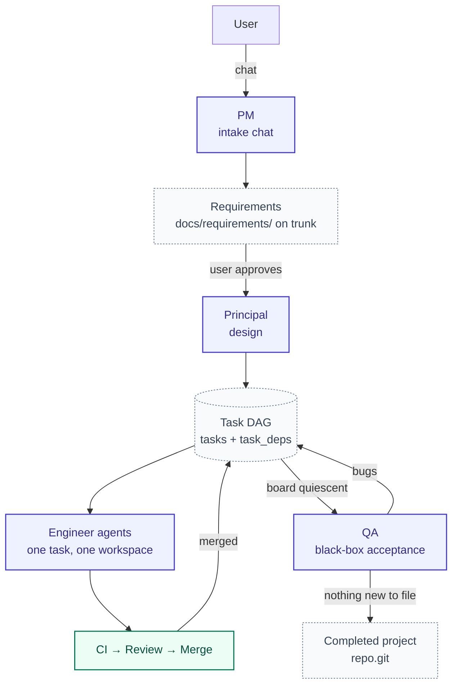
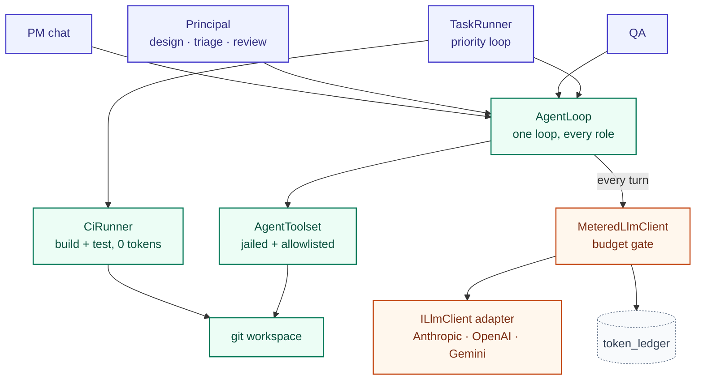
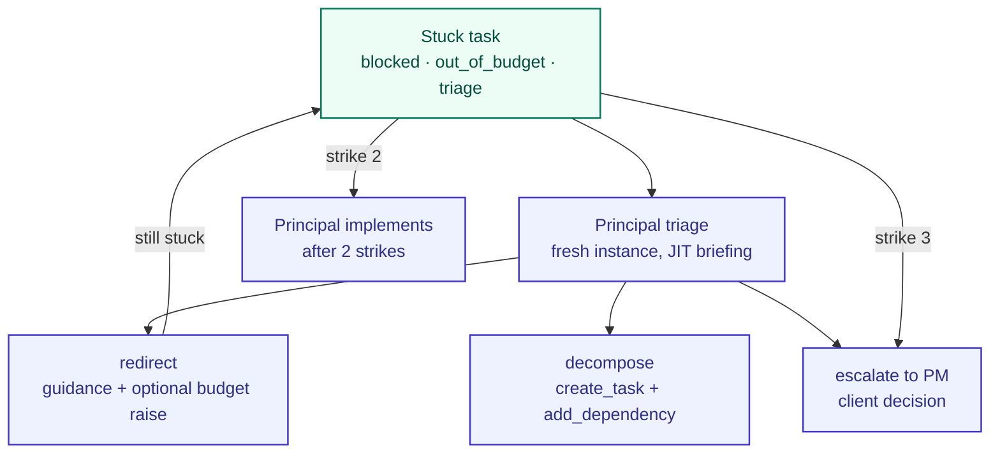
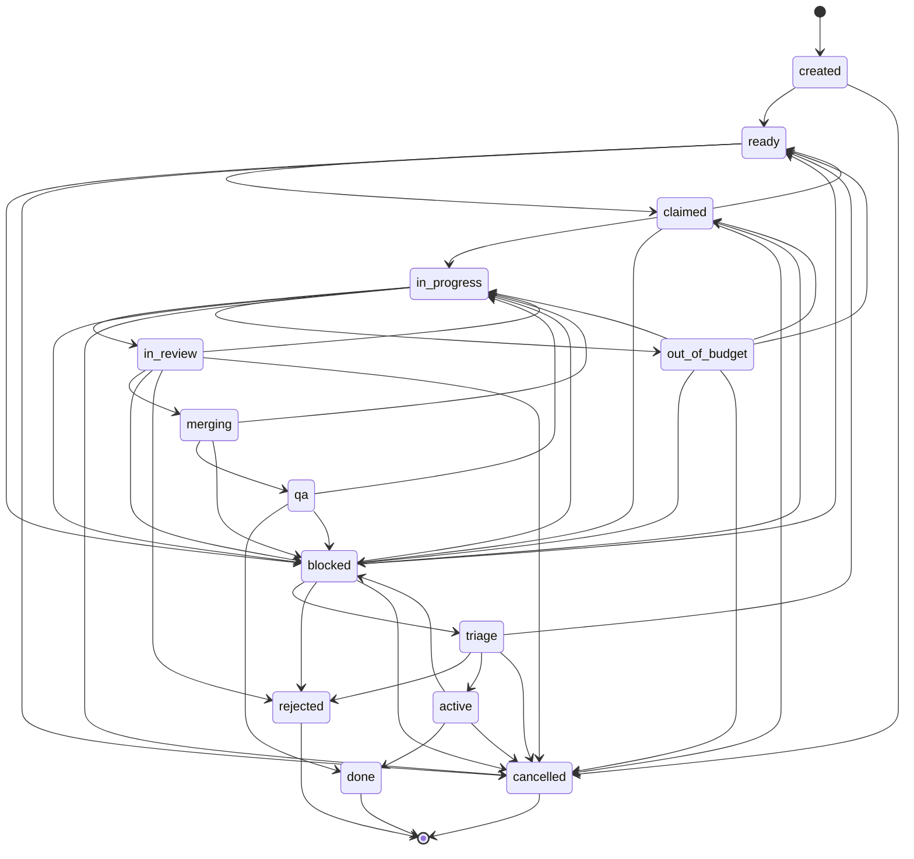

# Architecture

## Overview

Forge builds software from a plain-English idea by running a team of stateless
LLM agents against a real git repository. This document is the system design.
It is the authoritative description of how Forge works and assumes no prior
familiarity with the code. [`README.md`](README.md) covers what Forge is and
how to use it; [`CLAUDE.md`](CLAUDE.md) records the engineering decisions
behind this design.

The governing principle is:

> **The model proposes, the harness decides.**

An agent's output is a proposal — text containing tool calls. Nothing an agent
says is treated as fact. Whether a file was written, a build passed, a branch
merged, or a task advanced is decided by deterministic code reading git state
and process output.

Forge is one process with two layers.

**Orchestrator** — the roles (PM, Principal, Engineer, QA), the task DAG, the
scheduler, the integration pipeline, and the board. It decides *what should
happen*.

**Harness** — the deterministic machine wrapped around every LLM call:

```
assemble context → call the model → parse tool calls → execute them jailed
→ feed observations back → enforce budget and iteration caps → persist the
ledger and a progress note
```

It decides *what is allowed to happen, and what actually did*. Harness code is
trusted; everything arriving from a model is untrusted input under
supervision.

The orchestrator drives the harness, and the harness never asks a model for a
decision it can compute itself. Budgets are enforced by refusing the next
call, not by asking a model to stop. Merges are gated on git, not on an agent
reporting success.

---

## System Architecture

### Project lifecycle



1. **Intake.** The user talks to the PM, the only role with a human interface.
   The PM writes requirements to `docs/requirements/` on trunk and puts them to
   the user with `propose_requirements`; the user approving is what opens the
   Feature — the single handoff to engineering.
2. **Design.** A Principal instance turns the requirements into project
   structure, contracts, conventions, and a task DAG of database rows with
   dependency edges. A coverage gate checks mechanically that every
   requirement file is claimed by at least one task.
3. **Build.** The scheduler hands claimable tasks to Engineer agents, one task
   per isolated workspace.
4. **Integration.** Each finished task passes commit → CI → review → merge.
   Failures return to the engineer with feedback; a task never advances on an
   agent's own claim.
5. **Acceptance.** Once the board is quiescent, QA exercises the built project
   through its CLI or HTTP surface and files a bug per unmet requirement. Bugs
   are triaged and re-enter the build loop.
6. **Completion.** A QA round that produces no new accepted work ends the
   project.

A change request re-enters at step 1 and reuses every step after it. The
Principal produces an impact analysis instead of a greenfield design and
creates only the delta tasks.

### Roles

A role is a recipe, not a process: spinning one up means inserting an
agent-instance row and assembling its context. Work pulls workers.

| Role | Tier | Always in context | Never sees |
|---|---|---|---|
| PM | Reasoning | PROJECT.md, STATUS.md, requirements INDEX | code |
| Principal | Reasoning | PROJECT.md, CONVENTIONS.md, requirements INDEX | full-codebase dumps |
| Engineer | Coding | CONVENTIONS.md + its task packet | requirements docs, other tasks |
| QA | Coding | PROJECT.md, requirements INDEX | source code |

The Principal has three further recipes for review, triage, and direct
implementation — same role and tier, different tools and seeding.

The PM owns requirement fidelity and the Principal owns technical decisions.
The Principal wins technical deadlocks with engineers; a PM/Principal deadlock
escalates to the client.

### The project repository

The generated repo is the shared memory. The Principal authors this structure
during design, and every role navigates it rather than receiving a codebase
dump: each directory carries a summary file good enough to decide whether to
descend.

```
PROJECT.md              one-pager: what, why, current milestone
CONVENTIONS.md          the rules — under a page; grows via review write-backs
STATUS.md               PM-maintained; answers client status queries at zero tokens
docs/
  requirements/         INDEX.md + NN-<feature>.md, versioned; PM-owned
  design/               architecture, data model, contracts/, decisions/ (ADRs)
src/<module>/MODULE.md  purpose, public interface, key decisions, gotchas
tests/
```

Docs live in git beside the code, so design and implementation cannot silently
diverge and a change request is a diff the client can read. Updating MODULE.md
for touched modules is part of every task's definition of done, and the
reviewer checks it.

### Execution convergence

PM chat, design, triage, review, QA, and engineering are different callers,
but they converge on one agent runtime, one metering gate, and one set of
provider adapters.



A new role is a recipe plus a prompt file, not new execution machinery.

---

## Core Components

### Agent Runtime

`Agents/` — the harness's execution engine.

**One loop, every role.** `AgentLoop` calls the model, parses tool calls out
of the response text, executes them through the jailed toolset, appends the
results, and repeats until an ending tool is called or the iteration cap is
reached.

```
for turn in 1..IterationCap:
    response = llm.CompleteAsync(system, conversation)   # metered
    calls    = ToolCallParser.Parse(response.Content)
    if no calls: nudge (3 strikes → crash)
    for call in calls:
        outcome = toolset.ExecuteAsync(call)             # jailed, allowlisted
        if outcome ends the turn: break
    conversation += observations + any pending nudges
```

One loop is why the safety properties are universal: metering, the jail,
budget refusal, the iteration cap, and progress-note persistence apply to a PM
chat turn exactly as they do to an engineer's build turn, because there is
only one place to implement them.

**Recipes are the only per-role variation.** An `AgentRecipe` declares the
model tier, the prompt files, the tool allowlist, and a `PathScope`. The
allowlist is both what the toolset enforces and what the prompt documents, so
a role cannot be told about a tool it does not have. The scope makes "the PM
never sees code" mechanical: the PM is scoped to `PROJECT.md`, `STATUS.md`,
and `docs/`, so `read_file src/…` is refused by the harness.

**Prompts are assembled, never stored.** Instructions come from three layers,
built at spin-up:

| Layer | Source | Where it lands |
|---|---|---|
| A — role identity | `prompts/roles/<role>.md`, versioned in git | system prompt, every turn |
| B — task-type rules | `prompts/tasks/<type>.md` | system prompt, task work only — a chat has no task type |
| C — task packet | the assignment: objective, acceptance criteria, requirements ref, context paths, progress note, read from the `tasks` row | the agent's first user turn |

Two more blocks join the system prompt: the **tool protocol**, generated from
`recipe.Tools` instead of written as prose, so the documented surface cannot
drift from the executable one; and any standing context the recipe declares
(`CONVENTIONS.md` and similar), read from the workspace each turn.

No prompt is stored on the task row, and the packet exists only inside the
prompt — the harness writes no markdown to disk. Repository markdown is
written by agents through `write_file`. Fixing `prompts/roles/engineer.md`
therefore improves every future engineer task with no code change.

**Conversation lifecycle.** Agents are stateless between instances; durable
state lives in the database and the workspace. Four entry points seed the same
loop — a task packet, a triage briefing, a review diff, or a chat history —
and every instance ends with a progress note. If a model never writes one, the
harness synthesizes it from the last message; the resume path depends on a
note existing, so it cannot be left to the model's discretion.

The model is resolved once per instance, not per turn. A conversation must not
change models underneath itself.

**Failure handling.** Every provider failure resolves to one of three outcomes
at the call site. Budget exhaustion ends the instance as `Budget`. Any other
provider exception — auth failure, rate limit, HTTP timeout — ends it as
`Crash`. Genuine cancellation propagates and stops the run. A crash never
kills the process: it ends the instance with the workspace and progress note
intact, so a fresh instance resumes.

Two nudges warn a model before it runs out of room. `MeteredLlmClient` injects
one at 70% of the task's token budget; `AgentLoop` injects the turn-count
equivalent at 70% of the iteration cap. The final turn carries a harder nudge
to call an ending tool now. Token spend and turn count are tracked by
different owners, so each needs its own signal.

### Task Management

`Scheduling/`, `Model/`, `Db/` — the board and the scheduler.

**The DAG is data, not prose.** Design produces `tasks` rows and `task_deps`
edges, so claimability is a database query rather than an interpretation of a
plan document.

Task types are `Feature` (a parent that decomposes into children), `Task`,
`Bug`, and `Chore`. A Feature is the PM's unit of handoff; its children
inherit its milestone.

**Every state change is validated.** `TaskTransitions.Legal` is a single map
of permitted transitions; every write goes through it and an illegal
transition throws. One map defines every route a task can take, and a bad
write fails where it happens instead of leaving the board in a state nothing
can explain. Full map and status list in
[Appendix A](#appendix-a-task-states).

**Ownership is derived from status.** `TaskTransitions.RoleFor(status)` maps a
status to the role that owns it. Ownership is never stored alongside status: a
stored owner beside a stored status is two sources of truth that can disagree,
and that whole class of bug disappears when the answer is a function of the
status.

**The scheduler is a three-tier priority loop.** Each tick of
`forge run --loop` resolves in order:

1. **Stuck work first** — anything the Principal owns (`blocked`,
   `out_of_budget`, `triage`). Stuck tasks usually gate the rest of the DAG.
2. **Then claimable engineer work** — a `ready` task with no unmet dependency,
   or a resumable `in_progress`/`claimed` task. Resumption is checked first: a
   task left `in_progress` means its worker was killed and its workspace is
   still on disk, and claiming new work while abandoned work sits there leaks
   tasks.
3. **Then closure** — close any `active` Feature whose children are all
   terminal, and run QA if the board is quiescent with new finished work to
   verify.

**One build at a time, machine-wide.** A heartbeat lease
(`Scheduling/WorkerLease.cs`) at `<data root>/worker.json` is taken by both a
terminal `forge run` and the board's Start button, so they cannot collide on
one database. Acquisition is atomic, and staleness is judged by heartbeat, so
a crashed worker frees the lease by falling silent. Stopping mid-task is safe:
the cancelled instance parks and the task resumes through the normal
kill-and-resume path.

### Execution Safety

Agent output is untrusted. Four mechanisms enforce that.

**Jailed workspaces.** Each task gets its own git clone at
`projects/<name>/workspaces/task-<id>/`, created on claim and deleted after
merge. That directory is the tool executor's jail: every path a tool receives
is resolved against the jail root, and anything outside is refused. Tasks
cannot see or corrupt each other's work, and a killed task leaves a workspace
the resume path picks up intact.

**Allowlisted tools and scoped paths.** A tool runs only if the recipe's
allowlist contains it, and `PathScope` further limits which files the role may
touch. Both checks live in the toolset, so a refusal is a logged harness
decision (`tool.refused`), not a convention the model is asked to respect.

**Scrubbed child environments.** An agent's `run` command is arbitrary code
execution, so the executor builds child environments from an allowlist (PATH,
TMPDIR, LANG, DOTNET_*/NUGET_*) rather than by inheritance, and points HOME at
the jail. Forge's own credentials live in `~/forge_env` and are never
inherited, so a key added there tomorrow is invisible to agents by default.
Client secrets live in an encrypted vault, reach agents only as
`{{secret:NAME}}`, are substituted at exec time, and are redacted back out of
captured output — values never reach the database, the context, or the logs.

**Ground truth from git and process output.** Merge state is read from git,
build and test state from process exit codes and output. An engineer reporting
"done" with no commits ahead of trunk does not merge. CI runs in the harness
(`Ci/CiRunner.cs`) as trusted code — not through the jailed executor, not as
an LLM call — and therefore costs zero tokens. A repository with no
`.sln`/`.csproj` is a skip, not a failure: docs-only tasks and
not-yet-scaffolded projects are legitimate.

**The integration pipeline** applies these in a fixed order: commit → verify
commits ahead → push → CI → review → merge. CI precedes review so the
Principal never spends tokens on a diff that does not build. Review is a fresh
Principal instance seeded with the branch diff — reviewer is never author —
ending in `approve` (merge) or `request_changes` (back to the engineer, with
the feedback written into the progress note, so the next instance's packet
already carries it). A `request_changes` may also carry a convention, appended
to `CONVENTIONS.md` on trunk, ruling out a recurring mistake once for every
future engineer. The revision loop is bounded; past the cap the task blocks
and escalates.

Any exception during integration parks the task as `blocked` with its branch
and workspace intact, rather than stranding it in a state nothing will claim.

### Autonomous Recovery

Agents fail: ambiguous requirements, wrong approach, work larger than the
budget allowed. Recovery is a bounded ladder run by the harness, not a
behavior requested of a model.

A task enters recovery when it exhausts its token budget, hits its iteration
cap unfinished, or is blocked during integration. By the ownership rule, the
Principal owns it from that moment.



- **Triage** spins a fresh Principal instance with a just-in-time briefing
  built from the stuck task's workspace and progress note, not baked into the
  role prompt. It ends with exactly one of: *redirect* the engineer with
  concrete guidance and optionally a raised budget; *decompose* the task and
  redirect what remains; or *escalate* a requirements question only the client
  can answer.
- **Decomposition** of a Feature runs the design phase in greenfield or
  change-request mode. Every subtask created by triage or decomposition is
  back-filled with its parent id and milestone and released to `ready` in the
  same step; `created` has no other automatic release path, so an unreleased
  subtask would deadlock the board.
- **Direct implementation** takes over after two failed strikes. The Principal
  implements the task itself with a fresh budget, through the same CI + review
  + merge gate as an engineer — seniority buys no exemption from verification.
- **Escalation** is the last rung. The task blocks and a message reaches the
  PM, where the human resolves it in the normal chat. The autonomous loop
  never waits on a human: an escalated task is skipped.
- **Transient provider failures retry in place**, up to a crash cap, instead
  of consuming a strike. A rate limit is not an agent failing at its task.

Every rung is counted from `agent_instances` rows rather than an agent's
self-report, so the ladder terminates by construction.

### QA System

QA is the project-level acceptance gate.

**Project-level, not per-task.** A scaffold or a half-built feature has no
observable behavior to black-box, so acceptance is a property of the finished
project. QA runs only when the board is quiescent and there is new finished
work to verify.

**Black-box.** A QA instance clones trunk fresh, reads `docs/requirements/`
and `docs/design/`, and exercises the project through the CLI or HTTP contract
the Principal designed. It does not read source, does not consider the
engineer's unit tests, and does not judge aesthetics — visual feel is the
client's call. Every feature must be verifiable from that side channel, which
constrains design: where a behavior would otherwise be internal, the Principal
has to expose it on the contract.

**Bugs are first-class tasks.** `file_bug` creates a `bug` task born in
`triage`. The Principal either accepts it (→ `ready`, fixed by an engineer
through the normal gate) or rejects it (→ `rejected`, a durable "not a bug"
verdict that is kept, never deleted). Rejected bugs stay in the ledger QA is
seeded with, so the same non-bug is not re-filed.

A filed bug carries machine-captured evidence: the toolset attaches QA's most
recent `run` command and its verbatim output, and `file_bug` refuses if QA has
executed nothing. Model prose is not accepted as a repro.

**Completion is decided by counting.** A watermark records how much done work
QA has verified, and QA re-runs only when the count of done tasks exceeds it.
A round that files nothing, or whose bugs are all rejected, never advances the
count — so the next tick finds nothing new and the project is complete. A
round that keeps finding real bugs re-triggers after each fix, up to a round
cap, past which the harness escalates rather than looping forever.

Because termination depends on the counters rather than the model's diligence,
a QA round that crashes does not advance the watermark, and neither does one
refused by the project budget. Either would falsely mark the project verified.

The same watermark re-arms QA after a change request, so a delta's completed
tasks trigger a full acceptance re-run that also catches regressions.

---

## LLM Provider Architecture

Forge talks to Claude, OpenAI, and Gemini behind one interface. Provider
differences are absorbed at the edge, so nothing downstream — ledger, pricer,
budget gate, scheduler — knows which provider is configured.

**`ILlmClient`** is one completion method plus `ModelFor(ModelTier)`. Three
adapters implement it: `Llm/AnthropicLlmClient.cs`, `OpenAiLlmClient.cs`,
`GeminiLlmClient.cs`.

**No code names a model.** A recipe asks for a `ModelTier` — `Fast`,
`Coding`, or `Reasoning` — and the configured adapter resolves it to a
provider-native model id. Orchestration policy ("an engineer needs the coding
tier") stays separate from provider knowledge ("what that tier is called at
Anthropic today"). Adding a provider is one adapter class plus one case in
`LlmClientFactory`.

**Usage is normalized at the adapter.** `LlmUsage` carries four token buckets
— uncached input, output, cache reads, cache writes — and each means the same
thing regardless of source. Providers disagree about what their raw counters
include, so the adapter is the only place that knows:

| Provider | Raw report | Normalization |
|---|---|---|
| Anthropic | `input_tokens` already excludes cached tokens | passed through |
| OpenAI | `prompt_tokens` is the whole prompt; `cached_tokens` is a subset | `TokensIn = prompt_tokens - cached_tokens` |
| Gemini | `promptTokenCount` is the total effective prompt even when cached | `TokensIn = promptTokenCount - cachedContentTokenCount` |

Two billing asymmetries are absorbed in the same place. OpenAI reports
cache-write tokens but prices no cache-write rate, billing them as ordinary
input, so they stay inside `TokensIn` and `CacheWriteTokens` reports zero —
mapping them across would ask the pricer for a rate that does not exist.
Gemini reports thinking tokens separately from output but bills them as
output, so output is the sum of both.

**Model ids are canonical end to end.** One string per model travels through
recipe, ledger, and pricer, so no name mapping can mis-price a call. Where a
provider's wire format differs, the adapter converts at the single point that
builds the request.

**Prices are fetched, never hardcoded.** `PriceCatalog` reads a public price
table keyed by provider-native model ids — the exact strings recipes resolve
to — cached in memory for the process and on disk with a short TTL. A failed
refresh falls back to the last snapshot. A model missing from the table forces
one refresh before it may fail, since the everyday cost of a TTL is a model
newer than the table. An unpriced model refuses to run rather than costing $0,
because a $0 rate is a cap that can never trip.

The ledger stores all four buckets alongside the computed cost and the price
snapshot used, so a row's cost is recomputable if a rate is later corrected.
That is what makes depending on an external price feed safe.

**Provider selection is configuration**, resolved in order:
`FORGE_LLM_PROVIDER` → the project's setting in `project_meta` → the
machine-wide `<data root>/llm.json` → the built-in default. `llm.json` may
also pin a model per tier. Malformed configuration throws rather than falling
back, since the only other symptom would be an unexpected bill.

---

## Budget Architecture

Every LLM call passes through one decorator, `Llm/MeteredLlmClient.cs`,
wrapping whichever adapter is configured:

```
CompleteAsync(request):
    RefuseIfExhausted(attribution)     # throws before the call is made
    response = inner.CompleteAsync(request)
    Record(request, response.Usage)    # ledger row + tokens_spent + nudge
    return response
```

Budgets are enforced by refusing the next call. A model is never asked to stop
spending.

There are two budgets, in different units, guarding different risks, failing
in different ways.

| | Project budget | Task budget |
|---|---|---|
| Unit | USD | tokens |
| Guards | the client's total spend | one runaway agent |
| Source of truth | `SUM(cost_nanos)` over `token_ledger`, priced from all four buckets against the live rate table | `tasks.tokens_spent` vs `tasks.token_budget` |
| Read | every call, so raising it from the board takes effect on the next call, not after a restart | every call |
| Accuracy | exact | approximate by design — counts only input + output, undercounting real traffic because cache reads dominate |
| On exhaustion | **pauses** | **strikes** |

**A spent project cap pauses.** The task is left exactly as it stands:
claimable, no strike, workspace intact. The loop stops pulling work, one
deduplicated escalation reaches the PM, and QA and triage short-circuit
without advancing the QA watermark. Running out of money is a client decision,
not a failure of the work, so nothing about the board's state should change to
reflect it.

**A spent task budget strikes.** The strike count increments, the task moves
to `out_of_budget`, and the Principal's recovery ladder takes over. Being
approximate is acceptable here: dollar safety is the project cap's job.

Both reach `AgentLoop` as the same end reason, distinguished by one flag on
the exception. The loop only passes that flag upward; deciding what a spent
budget means for a task belongs to the scheduler alone, never split across two
owners that could disagree.

**Nudges precede refusal.** Crossing 70% of a task's token budget queues a
system message delivered into the next turn — wrap up, or write a progress
note and escalate — so a well-behaved agent can land cleanly instead of being
cut off mid-thought. Escalations to the PM are deduplicated against pending
ones, so a tripped cap surfaces once rather than once per refused call.

---

## Design Principles

- **The model proposes, the harness decides.** Every consequential decision is
  computed by trusted code from observable state.
- **Agents never directly control system state.** A tool call is a request;
  the harness executes, validates, or refuses it.
- **Git and process output are the source of truth.** Merge, build, and test
  status are read, never believed.
- **All state transitions are validated.** One legal-transition map, no raw
  status writes.
- **Derived beats stored.** Task ownership, milestone state, and routing are
  computed from status. Two stored facts that must agree will eventually
  disagree.
- **Context is navigated, not loaded.** Summary files at every level let an
  agent prune; no agent receives the whole codebase.
- **Communication is artifact-centered.** Every message references a task,
  diff, bug, or decision and carries a type. There are no open-ended agent
  chat channels.
- **Generation is cheap, verification is expensive.** The coding tier writes
  code; the reasoning tier designs and reviews. Reading a diff costs a
  fraction of producing one, which is what makes review affordable.
- **Structure up front, detail per milestone.** Module boundaries and external
  contracts are expensive to change and are settled during design; features
  are elaborated milestone by milestone.
- **Every LLM call passes through the budget layer.** One decorator, no
  bypass, one ledger.
- **Provider differences are isolated behind adapters.** Nothing downstream of
  `ILlmClient` knows which provider is configured.
- **Termination is guaranteed by counting, not by diligence.** Strike ladders,
  revision caps, and the QA watermark all bound loops mechanically.
- **Prompts are assembled from versioned files.** Improving a template
  improves every future instance of that role.
- **Secrets never reach agent-visible surfaces.** Forge's credentials are not
  inherited by child processes; client secrets are placeholders until exec
  time and redacted from output.
- **Everything a generated project does must be verifiable from outside it.**
  Behavior that is not observable over CLI or HTTP cannot be accepted.

---

## Code Map

```
src/Forge.Core/          orchestrator + harness
  Agents/                AgentLoop, AgentRecipe, PromptAssembler, ToolCallParser
  Scheduling/            TaskRunner (priority loop, triage, integration), WorkerLease
  Model/                 TaskRecord, TaskTransitions, Message, enums, records
  Db/                    schema, repositories, Dapper type handlers
  Tools/                 AgentToolset, ToolExecutor, PathJail, PathScope
  Workspaces/            WorkspaceManager, Git — clones, branches, diffs, merges
  Ci/                    CiRunner — harness-run build + test
  Design/                DesignPhase, CoverageGate
  Review/                ReviewPhase
  Chat/                  PmChat
  Llm/                   ILlmClient, three adapters, MeteredLlmClient, Pricing/
  Board/                 BoardQuery, SpecReader — the read model behind forge board
  Secrets/               encrypted vault
  Logging/               ForgeLogger, EventType, log sinks
  Configuration/         data root, EnvFile, llm.json

src/Forge.Cli/           the forge command-line interface
  Commands/              one class per command
  wwwroot/               the board page

prompts/
  roles/                 layer A — per-role identity
  tasks/                 layer B — per-task-type instructions

tests/Forge.Tests/       test suite
```

Runtime data lives under a second root, never inside this repository:

```
<data root>/                       ~/forge-data, or $FORGE_HOME
  forge.db                         global project registry
  vault/                           encrypted client secrets
  prices/                          cached price table
  worker.json                      the machine-wide build lease
  projects/<name>/
    project.db                     queue, board, ledger, messages
    repo.git                       bare repo — source of truth for generated code
    workspaces/task-<id>/          per-task jail, created on claim
    forge.log                      per-project event log

~/forge_env                        Forge's own credentials, never inherited
```

### Related documents

- [`README.md`](README.md) — what Forge is and how to use it.
- [`CLAUDE.md`](CLAUDE.md) — the engineering decisions behind this design.

---

## Appendix A: Task states

Every status in `TaskStatus`, what it means, and the role
`TaskTransitions.RoleFor` hands it to. A status with no owner needs no
handoff: the scheduler claims it for an engineer, the harness is mid-operation,
or the task is finished.

| Status | Meaning | Owner |
|---|---|---|
| `created` | exists but not released to the board | PM |
| `ready` | claimable — dependencies met | — |
| `claimed` | leased by a worker, agent not started | — |
| `in_progress` | an engineer is working it, or was killed mid-work and it is resumable | — |
| `in_review` | pushed and CI-passed, awaiting the reviewer's verdict | Principal |
| `merging` | approved; the harness is merging to trunk | — |
| `qa` | per-task hop kept in the map and passed through automatically; acceptance is project-level | QA |
| `done` | merged, terminal | — |
| `blocked` | stuck and needing a decision | Principal |
| `out_of_budget` | the task's token budget is spent | Principal |
| `triage` | a filed bug or a new Feature awaiting the Principal | Principal |
| `active` | a Feature that has been decomposed; children are building, and the queue does not re-claim it | — |
| `rejected` | closed without being built — a durable "not a bug" verdict, terminal | — |
| `cancelled` | abandoned, terminal | — |

Escalation climbs engineer → Principal → PM → client. A stalled task is the
Principal's because the Principal authored the DAG, structure, and contracts;
the PM can neither set a budget nor make a technical call, and is only the
client-facing rung.

`blocked` and `out_of_budget` carry more outbound edges than any other status
because that is where the recovery ladder operates — a stuck task can be
redirected, split, taken over, or escalated, and the map must legalize each
exit.


