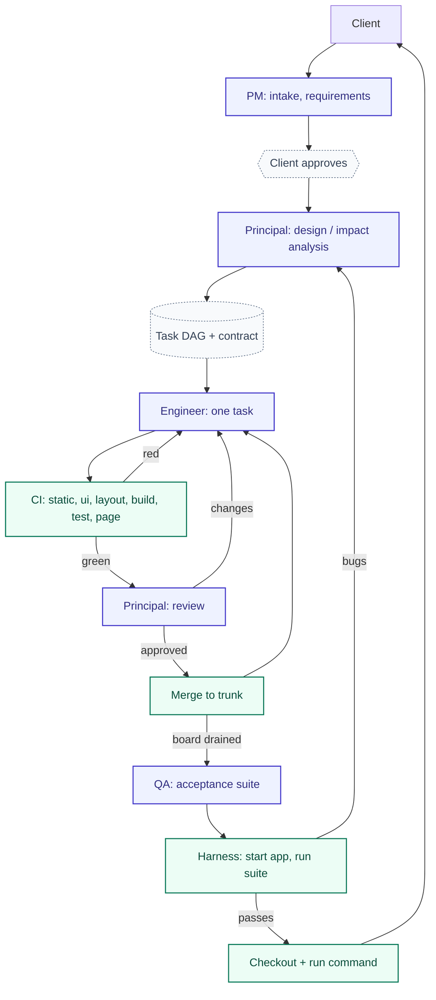
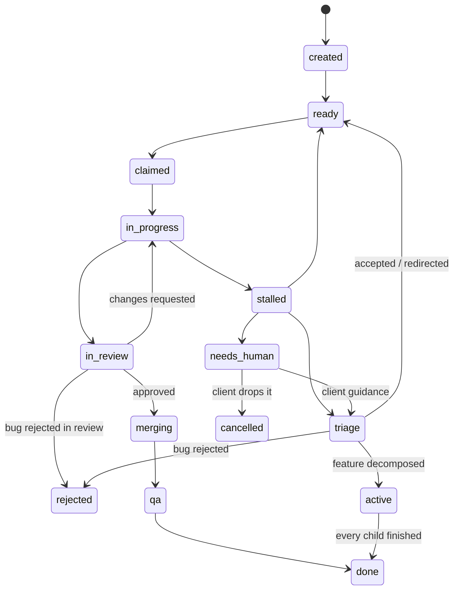

# Architecture

How Forge works, in enough detail to change it. `README.md` is for people using
Forge; `CLAUDE.md` states the rules a change must respect. This document explains
mechanism: what runs, in what order, and where each fact comes from.

---

## Overview

Forge takes a plain-English idea and produces a .NET repository, by running
stateless LLM agents inside a deterministic supervisor.

Two layers, one process:

- The **orchestrator** owns the project: the task board, the state machine, the
  roles, the scheduler.
- The **harness** is the loop wrapped around every model call: assemble context →
  call the provider → parse tool calls → execute them in a jail → feed observations
  back → enforce budgets and turn caps → write the ledger and the progress note.

Everything the harness does is ordinary code. Everything a model emits is untrusted
output under supervision. That line explains most of the design: CI is a process
exit code rather than an agent's claim, a bug carries the harness's own capture of
what was run, a page is judged by rendering it, and a budget is enforced by refusing
the next call rather than by asking a model to stop.



---

## Project lifecycle

### First build

1. **Intake.** The client talks to the PM (`forge chat`, or the board's chat panel).
   Each turn is a fresh PM instance whose memory is the `messages` table replayed as
   a conversation. The PM writes `docs/requirements/NN-*.md` in a long-lived clone of
   trunk and commits straight to it.
2. **Proposal.** `propose_requirements` stages a Feature in `project_meta`. The board
   shows it with the spec; the client approves or declines.
3. **Approval** is the client's one commitment. It creates the Feature row (type
   `feature`, status `triage`, assigned to the Principal), writes an immediate
   acknowledgement into the chat, and starts a worker.
4. **Design.** The worker picks the Feature off the Principal's queue and runs
   `DesignPhase` on a trunk clone: the Principal scaffolds the solution, chooses a
   theme, writes `CONVENTIONS.md` additions, `MODULE.md` per module, the OpenAPI
   contract, and the task DAG via `create_task` / `add_dependency`. Three coverage
   gates then run mechanically. Every task it created becomes a child of the Feature
   and is released to `ready`; the Feature moves to `active`.
5. **Build.** The worker loop claims tasks, runs an engineer per task in its own
   workspace, and takes each through CI → review → merge.
6. **Close.** When every child of a Feature is terminal the Feature closes to `done`,
   which is what makes the board quiescent and arms QA.
7. **QA.** With no task work left, QA writes or updates the acceptance suite; the
   harness builds it, starts the app, runs it, and files a bug per failure. Bugs are
   triaged by the Principal and fixed through the normal loop. A round that produces
   no new accepted work ends the cycle.
8. **Delivery.** Trunk is cloned to `projects/<name>/build/`, the run command is
   derived, `spec_baseline_sha` is recorded, and the PM tells the client where it is
   and how to run it.

### Change request

The same spine, with the delta substituted for the whole:

- The client asks in the same chat. The PM edits the affected requirement files **in
  place**, since they describe the product as it is now, and records what changed in
  `docs/requirements/changes/NNN-<slug>.md`, carrying the client's own words and what
  was removed. `propose_requirements` requires `change_request` and `changes` once a
  Feature exists.
- Approving stamps that entry `Status: approved <date>` on trunk and opens a new
  Feature.
- The design phase runs in change-request mode: the Principal reads the existing
  structure, writes an impact note to `docs/design/impact/`, updates the contract, and
  creates **only** the delta tasks, or escalates if the change is ill-advised.
- Nobody re-reads the whole specification. The review dialog and the Principal's brief
  are both seeded with the requirement lines added and removed since
  `spec_baseline_sha`, which is trunk's head at the last handover.
- Decomposing a Feature clears `qa_escalated` and `project_delivered`, so the change
  gets a fresh QA cycle and its own handover.

---

## Data model

### Two databases

- `<data root>/forge.db` is the global registry: project names, and the *names* of
  vault secrets (never values).
- `<data root>/projects/<name>/project.db` holds everything about one project: queue,
  board, ledger, conversation, audit. Opening it applies the schema and any pending
  migrations (`Db/Database.OpenProject`). WAL, foreign keys on.

Per-project settings live in that project's `project_meta`: a project directory is meant to be self-contained and movable,
and a machine-wide file cannot express two projects on different providers.

### Tables

| Table | What it holds |
|---|---|
| `tasks` | The board. Type, status, packet, budgets, counters, branch, parent Feature, milestone. |
| `task_deps` | The DAG: `task_id` waits on `depends_on`. Cycles are refused at insert. |
| `milestones` | The phases the client reads, in the order they were first named. |
| `messages` | Both the agent queue and the client conversation. `to_agent` + `status` is the queue; `from_agent='client'` or `to_agent='client'` is the chat. |
| `discussions` | What has been said *about* a task: review verdicts, CI feedback, the engineer's account, client guidance, and play markers. |
| `token_ledger` | One row per LLM call: instance, role, task, model, four token buckets, `cost_nanos`, `priced_with`. |
| `agent_instances` | One row per agent instance: id, role, model, task, start, end, end reason. |
| `project_meta` | Key/value orchestration state (below). |

`CHECK` constraints mirror the enums in `Model/Enums.cs`; both layers are maintained
by hand. Anything the harness queries or enforces is a real column; payloads only a
model reads (`context_paths`, `contract_ops`) are JSON TEXT.

### `project_meta` keys

| Key | Meaning |
|---|---|
| `llm_provider`, `budget_usd` | The project's provider and hard dollar cap. |
| `requirements_proposal` | The staged Feature awaiting the client's approval. |
| `qa_rounds` | How many QA rounds have completed. |
| `qa_verified_count` | The done-task count QA has verified; the termination watermark. |
| `qa_escalated` | A QA cycle that could not converge or complete; cleared by a new Feature. |
| `qa_suite_contract_sha` | The contract commit the committed suite was written against. |
| `project_delivered` | The handover has happened; re-armed by a new Feature. |
| `spec_baseline_sha` | Trunk head at the last handover; the client's copy of the spec. |
| `run_command`, `run_dir`, `run_url` | How the client starts the finished project. |
| `client_asked_about` | The set of stuck task ids the PM has already raised. |
| `theme`, `mode`, `accent`, `density`, `radius`, `theme_offer` | The interface's look. |

### Task states



- `stalled` is **the Principal's queue**, reachable from every live status. A task
  lands there whether the harness stopped it (budget, turns, a failed gate) or the
  agent gave up; both mean the same thing to whoever picks it up, and `stall_count`
  decides which rung of the ladder it gets.
- `triage` is the Principal's decision point for a filed bug, a Feature awaiting
  decomposition, and a task the client sent back with guidance.
- `active` means a Feature is decomposed and its children are building; nothing
  re-claims it.
- `needs_human` is parked on the client and appears in **no** queue, so the loop
  drains the rest of the board and stops.
- `rejected` and `cancelled` are terminal and kept, never deleted, so their ledger rows
  stay attributable.

Ownership is derived from status (`TaskTransitions.RoleFor`), never stored. Legal
transitions live in one map that throws on anything else; there is no path that writes
`status` directly.

---

## Agent runtime

### Recipes

A role is data (`Agents/AgentRecipe.cs`): a model tier, a role prompt, standing-context
files, its tools, its file scope, its binary allowlist, and its caps. Adding a role is
a record plus a prompt file. Every recipe is validated: a tool it lists must exist in
the catalogue, and an allowlist and a process-starting tool only make sense together.

| Recipe | Tier | Prefix | Tools beyond read/list/grep | Budget / turns |
|---|---|---|---|---|
| `Engineer` | Coding | `eng` | write_file, run, check_static, progress_note, done, escalate | 600k / 40 |
| `Pm` | Reasoning | `pm` | write_file, propose_requirements, offer_theme_choice, reject_bug, retriage, cancel_task, reply, escalate | 400k / 20 |
| `Principal` (design) | Reasoning | `prin` | write_file, scaffold, create_task, choose_theme, add_dependency, done, escalate | 900k / 60 |
| `PrincipalReview` | Reasoning | `rev` | write_file, approve, request_changes, reject_bug, escalate | 300k / 30 |
| `PrincipalTriage` | Reasoning | `triage` | create_task, add_dependency, redirect, break_and_relink, accept_bug, reject_bug, escalate | 300k / 20 |
| `PrincipalFinalTriage` | Reasoning | `final-triage` | as triage, **without** redirect; plus descope, cancel_task | 300k / 20 |
| `PrincipalImplementer` | Reasoning | `prin-impl` | the engineer's tools, on the reasoning tier | 900k / 80 |
| `QaSuiteAuthor`, when the project *has* an API contract | Coding | `qa-suite` | write_file, done, escalate, with no way to run anything | 500k / 40 |
| `Qa`, when the project has *no* contract, so QA drives the app itself | Coding | `qa` | write_file, run, serve, stop_server, http, file_bug, how_to_run, done, escalate | 500k / 40 |

Instance ids are `<prefix>-<yyyyMMdd-HHmmss>`, which is how the runner tells a Principal
implementation from an engineer attempt when counting.

### The prompt

Assembled per instance from three layers (`Agents/PromptAssembler.cs`):

- **A, role identity**: `prompts/roles/<role>.md`.
- **B, task type**: `prompts/tasks/<task|bug|chore>.md`. A chat turn has no task type
  and skips this layer.
- **C, the packet**: rendered from the task row into the first user turn. Never
  written to disk.

Appended to every system prompt: the tool protocol (generated from the recipe, so a
role is never told about a tool it does not have), and the recipe's standing-context
files if present (`CONVENTIONS.md`, `UI-KIT.md`, `PROJECT.md`, the requirements index).
A file that is not there is silently skipped, which is how a project with no interface
carries none of the UI kit.

The packet carries what would otherwise cost turns to rediscover: objective, acceptance
criteria, standing client guidance, the task's slice of the OpenAPI contract, the
contents of its `context_paths`, the discussion history, the branch's diff against
trunk (`WorkSoFar`), the budget, and the predecessor's progress note.

### The loop

`Agents/AgentLoop.cs`, one method every entry point shares (task work, triage, review,
chat):

1. Resolve the model **once per instance**, because a conversation must not change model
   underneath itself, along with the per-turn output ceiling from the provider.
2. Open an `agent_instances` row; the toolset is bound to this instance and disposed
   however it ends, so a server QA started is killed.
3. Each turn: call the provider with the conversation and the recipe's tool schemas;
   execute the tool calls in order; append observations, queued messages and any
   turn-cap nudge; repeat.
4. Stop on the agent's own ending tool (`done`, `escalate`, `reply`, a verdict), the
   iteration cap, a refused budget, or a provider failure.

Guards inside one instance:

| Condition | Limit | Result |
|---|---|---|
| Turn cut off at the output ceiling | 3 consecutive | Calls are dropped (their arguments are truncated), the model is told to send it smaller; then crash |
| Turn with no tool call at all | 3 consecutive | Told that text alone is discarded; then crash |
| Turn where every call was refused | 5 consecutive | Crash, with the refusals in the note |
| 70% of the turn cap | once | Wrap-up nudge |
| Final turn | once | Hard nudge: `done`, `progress_note` or `escalate` only |

An instance always leaves a progress note: its own, the caller's override, or its last
output verbatim. Across instances nothing survives but the workspace, that note, and
rows in the database.

### Ending reasons

`done`, `budget`, `iterations`, `crash`, `escalated`. The runner decides what each
means for the task; a `budget` ending additionally carries whether it was the project
dollar cap (pause) or the task token budget (strike).

---

## Execution safety

Every agent action passes through the same three checks before it has any effect.

**The jail.** `Tools/PathJail` resolves every path against the workspace root and
refuses anything that escapes it. The task workspace *is* the jail.

**The scope.** `Agents/PathScope` narrows that further per recipe. The PM is scoped to
`PROJECT.md`, `STATUS.md` and `docs/`, so `read_file src/…` is refused by the harness.
This is what makes "the PM never makes technical calls" true rather than aspirational.
Directory prefixes end in `/`, so `docs/` admits `docs/requirements/INDEX.md` but not
`docs-archive/x.md`.

**The executor.** `Tools/ToolExecutor` runs commands with:

- no shell: shell operators are refused at tokenisation, one binary per call;
- an allowlisted binary (`dotnet`, `git` for roles that have `run`), plus per-recipe
  refused prefixes (`dotnet new`, `dotnet sln`) that an allowlist cannot express;
- arguments rejected if they resolve outside the jail (absolute, `~`, `..`);
- an environment **built from an allowlist** (PATH, TMPDIR, LANG, `DOTNET_*`,
  `NUGET_*`), never inherited, with `HOME` pointed at the project's agent home. An
  agent's `dotnet run` is arbitrary code execution, so inheriting Forge's environment
  would hand it every provider key. A key added to `forge_env` tomorrow is invisible to
  agents by default.
- `{{secret:NAME}}` substituted from the vault at exec time and redacted back out of
  captured output. Values never reach the database, a prompt, or a log.

Refusals come back as observations, not exceptions: the agent sees the boundary and can
correct within the same instance.

**Workspaces** (`Workspaces/WorkspaceManager`):

- `repo.git` is bare and is the source of truth; trunk is `master`.
- A task gets a clone at `workspaces/task-<id>/` on claim, on branch
  `task/<id>-<slug>`, deleted after merge.
- Long-lived clones exist for roles that work on documents rather than tasks (`pm`,
  `principal`, `qa`, `bug-triage`, `theme`, `conventions`), reset and pulled each time.
- Commits, pushes and merges are the harness's, so what lands is the repo's record and
  not the agent's account. A conflicted merge is aborted so the workspace is left clean
  for the retry.

---

## Gates the harness runs

### CI (`Ci/CiRunner`)

Runs in the task workspace, as trusted code, costing nothing. In order, returning at
the first failure:

1. **Static files**: every `.js`, `.json` and inline `<script>` parses. The compiler
   never reads these; they ship as content and fail when someone loads the page.
2. **UI gate**: the page is built from the kit (below).
3. **Layout**: exactly one runnable project, and the acceptance suite is not in the
   solution (it needs a started app, so its presence would fail `dotnet test` for every
   task).
4. `dotnet build`.
5. `dotnet test`.
6. **Page check**: only when the diff touched the interface, and only if a browser is
   available.

A workspace with no `.sln`/`.csproj` is a **skip**, not a failure: docs-only work and a
not-yet-scaffolded repo are both legitimate. The step is injectable into `TaskRunner`,
so orchestration tests need no toolchain and no browser.

### Design gates (`Design/CoverageGate`)

Set comparisons, not model claims:

- every `docs/requirements/NN-*.md` is named by at least one task's `requirements_ref`;
- every requirement is served by a contract operation, a declared page, or is listed in
  `x-non-http-requirements`;
- every contract operation is claimed by some task's `contract_ops`;

An incomplete design parks the Feature on the client rather than releasing it, because
design is not idempotent and re-running it would duplicate the tasks it already created.

### The contract (`Design/ApiContract`, `Design/InterfaceContract`)

One document per project at `docs/design/contracts/openapi.yaml`, validated **at
`write_file`** so the author fixes it in the same instance. Every operation needs an
`operationId`, at least one 4xx/5xx response, and an `x-requirement` naming the file it
serves. Ids must be unique.

The interface rides in the same document under `x-interface`: each page declares its
`path`, the `requirement` it serves, and its `elements`, each with a `testid`, an `is`
phrase, and optionally `visible: always|on-demand` and `repeats`. Unknown keys are
refused by name with the valid ones listed. One shape, enforced at the boundary, so no
later change request can invent a second way to declare a handle.

Downstream, everything refers to operations by id: a task names the ones it implements
and is handed exactly those as an OpenAPI slice, an acceptance test tags itself with
one, and the gates compare the sets.

### The UI gate (`Ui/UiGate`)

Appearance is not generated work. Forge ships a component kit in
`prompts/templates/ui/` and installs it into every task workspace (`forge-ui.css`,
`forge-ui.js`, the project's `theme.css`, and `UI-KIT.md` at the repo root), overwriting
whatever is there, so "don't edit the kit" needs no rule. A repo with no single runnable
project gets none of it.

Four rules: no `style=` attribute, no literal colour or font outside the kit, no
stylesheet of the application's own beyond one `app.css`, and no class that neither the
kit nor `app.css` defines. `app.css` is the escape hatch so a missing component cannot
deadlock a task, and what it contains is put in front of the reviewer. Unknown `fg-`
classes are refused at write time with the real class names offered.

A theme is a selection from closed sets (theme id, `light|dark|auto`, accent, density,
radius), made by the Principal with `choose_theme`, or by the client from the board's
picker, whose tiles are painted with each theme's own CSS. Themes are read from the
files on disk, so adding a theme is adding one CSS file.

### The page check (`Ci/PageCheck`, `Ui/PageProbe`, `Ci/PageHealth`)

A page is verified by rendering it, never by reading markup: markup cannot say whether
an element is visible, where it sits, or what colour it resolved to. An element carrying
`hidden` renders in full if a class sets `display`; two "different" tints can resolve to
the same colour. Both were live defects.

`PageProbe` loads the running app in headless Chromium at 1280×900 and reports, per
element, its `data-testid`, tag, role, text, classes, box, visibility, `hidden`
attribute, and computed colours, plus console errors, failed requests, scroll width and
the navigation status.

Two tiers:

- **Generic health** (`PageHealth`, pure functions, no project knowledge): the page
  loaded, no console errors, no failed requests, no sideways overflow, nothing
  hidden-but-visible, no text below 4.5:1 contrast.
- **Declared handles**: every `data-testid` in `x-interface` is on the page, judged
  only for pages serving *this task's* requirement, since a handle missing from another
  task's page is that task's unwritten work. Repeating handles are exempt, because CI
  renders against an empty database.

Chromium is installed once per machine at `<data root>/browsers`. No browser, no
runnable app, or no interface change in the diff is a **skip**, never a failure. A
failed acceptance round attaches a screenshot, written outside the repo.

What is deliberately not checked: whether it looks good. That stays the client's, which
is what the theme picker is for.

---

## Recovery and termination

The worker is serial and runs one step per tick, in priority order: merging → review →
Principal-owned → ask the client → engineer work → close Features → QA. Part-finished
work is always cleared
before anything new is claimed, and every handler does its work first and transitions
last, so a crash either re-runs an idempotent step or leaves the task claimable.

### The ladder

A task that fails gets another try, but never the same try twice. Each failure counts a
strike, and the strike decides who gets the task next. Nothing an agent does clears a
count; otherwise a reviewer could buy five more attempts by rejecting the work again.

Two ladders run side by side, one for each way a task can fail.

**An engineer attempt that reached the gates and lost**, meaning CI went red or the
Principal rejected the diff:

- **Strikes 1–4**: back to an engineer, with the failure to work from.
- **Strike 5**: the Principal stops reviewing and **implements the task itself**. Its
  work skips review: it exists to escape the review loop, so re-entering it would defeat
  it. Three such attempts, and the task goes to a final triage.

**An instance that never got that far**, one that ran out of tokens or turns: the task
is `stalled` and the Principal decides what to do with it.

- **Strikes 1–2**: the Principal picks a play: point the engineer somewhere else
  (`redirect`), split an oversized task into smaller ones (`break_and_relink`), narrow
  what it has to achieve (`descope`), or hand it to the client (`escalate`).
- **Strike 3**: a final triage that has to cut the task down to something achievable.
  After that the task is **closed short**: it ends `done` with what is missing recorded,
  because cancelling it would strand every task waiting on it. What was left out surfaces
  in QA, where it can be acted on.

A crash is not a strike. The task is left claimable and picked up again, up to twice.

Two rules keep the ladder honest. A spent cap hands the task to the next rung, never to
the client, because why a task cannot pass CI is a technical question the client cannot
answer. And a rung only ever narrows the work or changes who does it; nothing lets a task keep
retrying the attempt that already failed.

The moves the Principal can make, in more detail:

- **`redirect`** sends the task back to an engineer with new guidance.
- **`break_and_relink`** replaces an oversized task with the smaller ones just created:
  every dependent is re-pointed at all of them, each inherits the old task's dependencies
  and Feature, and the original is cancelled. Every check runs before the first write, so
  a refusal leaves the graph untouched. Capped at two splits deep.
- **`descope`** narrows the acceptance criteria and sends the task back through the
  gates; what was left out must be filed as its own task.
- **`escalate`** parks the task on the client.
- **Cancelling** a task cancels every transitive dependent (a dependency edge is
  satisfied only by a `done` task) and discards their branches and workspaces.

### The client round trip

Work parked on `needs_human` is raised by the PM in one unprompted turn, in plain
language with no ids or budgets, and asked about once per distinct set of waiting tasks.
The client either answers or drops the task. An answer comes back as `retriage(task,
note)`, which records the guidance, clears the stall count and sends the task to the
Principal; that is the one thing that does reset a count, because the client has supplied
something the system did not have. Dropping it is `cancel_task(task, reason)`.

The loop never blocks on a human: `needs_human` is in no queue, so the worker drains the
rest of the board and stops.

### Project budget

A spent dollar cap is not a failure. The task is left exactly as it stands, no strike is
counted, one escalation reaches the PM, and the loop stops pulling work. Raising the cap
from the board and pressing Start resumes from there.

---

## QA and acceptance

QA is **project-level**. A scaffold or a half-built feature has no observable behaviour
to black-box; acceptance is a requirement concern. The per-task `qa` status survives as
an auto-passing hop in the merge path and decides nothing.

A round runs when the board is quiescent and more tasks are done than the last round
verified (`qa_verified_count`). A round that accepts nothing new never moves that
watermark, so QA is not called again and the project is complete. A project that never
converges escalates after 5 rounds.

Two modes, chosen by whether the project has a contract:

- **With a contract** (`QaSuiteAuthor`): QA writes black-box xUnit tests into
  `tests/acceptance/` and has no way to run anything. The harness scaffolds the project
  with `dotnet new xunit`, so package versions come from the installed SDK rather than a
  model's memory, then fixes its name at `AcceptanceTests.csproj`, deletes any stray project
  beside it, and writes two helpers: `Api.cs` (an `HttpClient` pointed at
  `FORGE_BASE_URL`) and `Browser.cs` (Playwright: `ByTestId`, `BoxAsync`, `StyleAsync`,
  `AreSideBySideAsync`, `AreDifferentColours`, `ScreenshotAsync`).
- **Without one**, such as a CLI tool or a library: the exploratory `Qa` recipe drives the app
  itself with `serve`/`http`/`run` and files what fails. There are no operations to cover
  mechanically, so driving it by hand is the only way to see anything.

The suite author's brief carries the contract's operations, the bug ledger (so it does
not re-file), and **the page as the harness measured it**: every declared handle, and
every element's real box, visibility and colour. It is told to assert relations rather
than the absolute numbers in that table, since the client can change the theme at any
time.

Running a round:

1. Build the suite. A suite that does not compile has tested nothing and must never be
   reported as a suite that failed, since a failed run becomes a bug and rejecting that
   bug would complete the project.
2. Commit it to trunk whatever the run says: a red suite is still the regression suite.
3. Check every contract operation is covered, read from `[Trait("operation", "<id>")]`.
4. Start the app on a free port (`ASPNETCORE_URLS=http://127.0.0.1:0`, the address read
   back from its own output), run `dotnet test` with `FORGE_BASE_URL` set, and take the
   exit code as the verdict.
5. A red run files one bug with the output verbatim and a screenshot of the page.

If the suite already covers an unchanged contract, compared by the sha of the commit
that last touched it, the round is a pure regression run and no model is called at all.

**Bugs** are first-class tasks born in `triage`. The Principal accepts (→ `ready`, fixed
through the normal loop) or rejects (→ `rejected`, kept with the reason and never
re-filed). A reviewer of a bug fix can also reject the bug, which is what stops a fix
loop over a defect that is not real. `file_bug` refuses without evidence: the harness
attaches the last thing it watched happen, so a bug cannot describe a result nobody
observed.

---

## Providers, cost and metering

### The tier abstraction

No code names a model. A recipe names a `ModelTier` (`Coding | Reasoning`) and
the configured `ILlmClient` resolves it. Orchestration policy ("an engineer needs the
coding tier") stays separate from provider knowledge ("what that tier is called today").

| Provider | Key | Coding / Reasoning |
|---|---|---|
| `anthropic` | `ANTHROPIC_API_KEY` | `claude-sonnet-5` / `claude-opus-4-8` |
| `openai` | `OPENAI_API_KEY` | `gpt-5` / `gpt-5.4` |
| `gemini` | `GEMINI_API_KEY` | `gemini-2.5-flash` / `gemini-3.6-flash` |

Adapters are hand-rolled over `HttpClient`; there is no SDK surface to keep in step.
Adding a provider is one adapter class with a two-entry tier map plus one case in
`LlmClientFactory`. Every default id is a key in the price table, so every default is
priceable out of the box.

### Normalising usage

The adapter normalises; the rest of Forge sees one meaning. `LlmUsage.TokensIn` is
always the **uncached prompt remainder**: Anthropic already excludes cached tokens,
while OpenAI and Gemini include them and must have the cached count subtracted. Two
further traps, both settled from the published schemas: OpenAI reports cache writes but
prices them as ordinary input, so they stay inside `TokensIn`; Gemini reports thinking
tokens separately but bills them as output, so output is the sum.

`RetryingLlmClient` retries transient failures with the provider's own `Retry-After`
where given. Anything else (auth, an outage, a timeout) ends the instance as a crash
with the workspace and note intact, and the resume path handles it.

### Prices

Fetched, never hardcoded, from LiteLLM's table, whose keys are provider-native model ids,
the exact strings recipes resolve to, so no name mapping can silently mis-price.
Cached in memory and on disk at `<data root>/prices/` with a 1-day TTL and a conditional
GET, machine-wide rather than per project. A failed refresh falls back to the stale
snapshot; a model miss forces one refresh before it is allowed to fail. An unpriced model
**refuses to run**: with a dollar budget, costing $0 is a cap that never trips.

### The two budgets

Both enforced in `MeteredLlmClient`, which wraps every call.

|  | Project budget | Task budget |
|---|---|---|
| Unit | USD | tokens |
| Scope | the whole project | one agent instance |
| Source | `project_meta.budget_usd`, re-read per call | `tasks.token_budget` |
| Counts | `SUM(cost_nanos)` over the ledger | `tokens_in + tokens_out` only |
| Exhausted | the build **pauses**, nothing is struck | the task **strikes** and climbs the ladder |

Cache reads are excluded from the task budget deliberately: they are a prompt the
provider already holds, so counting them made the same budget mean an order of magnitude
less on a caching provider. The task cap is an approximate guard on one runaway agent;
money safety is the dollar cap's job. `tasks.tokens_spent` is a reporting total and gates
nothing.

The ledger stores all four buckets, `cost_nanos` (USD × 1e-9 as an integer, so `SUM()`
stays exact) and `priced_with`, which is what makes a row's cost recomputable when a
rate is corrected. Per-role spend needs no extra attribution: `role` and
`agent_instance_id` have been on every row since the beginning.

A nudge is queued at 70% of the task budget and delivered with the next turn's
observations.

---

## The board

`forge board` hosts a minimal API inside the CLI (an ASP.NET `FrameworkReference`, not a
second executable) and serves one page for every project, with the project as a query
parameter. The page polls every 3 seconds.

| Endpoint | Purpose |
|---|---|
| `GET/POST /api/projects` | List projects; create one (name, budget, provider) |
| `GET /api/board` | The whole snapshot: plan, spend, chat, spec, changes, delivery, worker |
| `POST /api/chat` | Runs a real PM turn in the background behind a semaphore |
| `POST /api/proposal` | Approve or decline; approving opens the Feature and starts a worker |
| `POST /api/budget` | Raise the cap and clear the exhaustion escalation |
| `GET/POST /api/theme` | The theme tiles, and the client's choice |
| `POST /api/run` | Start or stop the build |

`Board/BoardQuery` is a **read model**: every figure is queried from tasks, milestones,
the ledger and messages at request time. Nothing is cached or denormalised, so the page
cannot drift from the ledger.

The page is one panel, the plan: milestones in order with their tasks under each, and
the task a worker holds blinking. Two milestones are the harness's own: `Getting started`
absorbs everything that was never a task (intake, the design run, a Feature's own
decomposition), and `Testing & fixes` holds every bug and QA's own rounds, which have no
task to attach to. Cost is charged from every task, including cancelled and rejected
ones, but only live ones are shown, so the phases still sum to the ledger.

"Building" and "working" are separate facts and stay separate: `state` is how far the
plan has got, read from the data; `building` is whether a worker is alive this second,
read from the lease.

**One build at a time, machine-wide** (`Scheduling/WorkerLease`): a JSON lease at
`<data root>/worker.json` carrying a heartbeat, taken by both the board's Start button
and a terminal `forge run`. Two properties are load-bearing: acquisition is atomic
(`FileMode.CreateNew`, not check-then-write), and the lease beats itself on a timer,
because one task run routinely outlasts the 90-second staleness window. A crashed worker
frees the lease by falling silent. Stopping mid-task is safe: the cancelled instance
parks and the task resumes through the normal path.

---

## Logging

Six columns, fixed: `timestamp | project | task | domain | action | message`. Every line
names its project; `task` is null for project-level events, so "all logs for the project"
and "logs for one task" are the same rows one filter apart.

`domain` and `action` are rendered from one closed `EventType` enum, split at write time
and reassembled on read, so the two columns can never disagree and filtering is an
equality check. Domains: `lifecycle`, `llm`, `tool` (one action per tool), `ci`,
`review`, `git`, `error`, and `message`. The `message` domain has an empty action: it is
the free-form, human-readable channel covering agent↔client communication and ordinary
service logging, and it is the line you actually read.

The API is two methods: `Event(EventType, msg)` for typed events, where the enum is the
only category argument, so a git merge cannot be mis-tagged as lifecycle; and
`Message(msg)` for the free-form channel. `.For(taskId)` binds the correlation once. Logging is optional
everywhere (`ForgeLogger.Null`), so nothing requires it to run.

Sinks are swappable behind `ILogSink`. The default writes `projects/<name>/forge.log`,
one per project, so isolation is structural; console, composite and null sinks exist and
a remote sink is a drop-in. Read it back with `forge log <project> --events [--task N]
[--domain D]`.

---

## Code map

```
src/Forge.Core/
  Agents/         AgentLoop, AgentRecipe, AgentToolset (+ QaTools), PromptAssembler,
                  PromptLibrary, PathScope, ToolDoc, ToolCall
  Board/          BoardQuery (read model), RequirementsProposal, SpecReader,
                  SpecBaseline, ChangeLog, DeliveryPlan, AppearanceChange, ThemeOffer
  Chat/           PmChat: the client conversation, replayed from messages
  Ci/             CiRunner, StaticFileCheck, PageCheck, PageHealth
  Configuration/  EnvFile (Forge's own keys), ClientFacing
  Db/             Database, Schema, Migrations, one repository per table, TypeHandlers
  Design/         DesignPhase, ApiContract, InterfaceContract, CoverageGate
  Llm/            ILlmClient, the three adapters, MeteredLlmClient, RetryingLlmClient,
                  LlmConfig, ModelTier, Pricing
  Logging/        ForgeLogger, EventType, ILogSink + sinks, LogReader
  Model/          TaskRecord + TaskTransitions, Message, Enums, RequirementsRef, Records
  Qa/             AcceptanceSuite, AppHost
  Review/         ReviewPhase
  Scaffolding/    SolutionScaffold
  Scheduling/     TaskRunner (the worker), WorkerLease
  Secrets/        SecretsVault (AES-GCM, machine-local key)
  Tools/          ToolExecutor, PathJail
  Ui/             UiKit, UiGate, ThemeChoice, PageProbe, PageReport
  ForgePaths, ProjectBootstrap, ProjectSettings

src/Forge.Cli/    Program (command registration), Commands/, wwwroot/ (the board page)
prompts/          roles/, tasks/, plays/, templates/ (CONVENTIONS.md + the UI kit)
tests/Forge.Tests/ ~395 xUnit tests; CI is injected, so no toolchain is required
```

### Related documents

- [`README.md`](README.md): using Forge.
- [`CLAUDE.md`](CLAUDE.md): the rules a change to Forge must respect.
