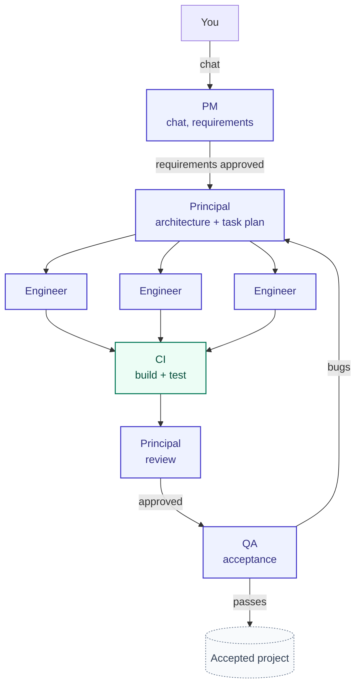
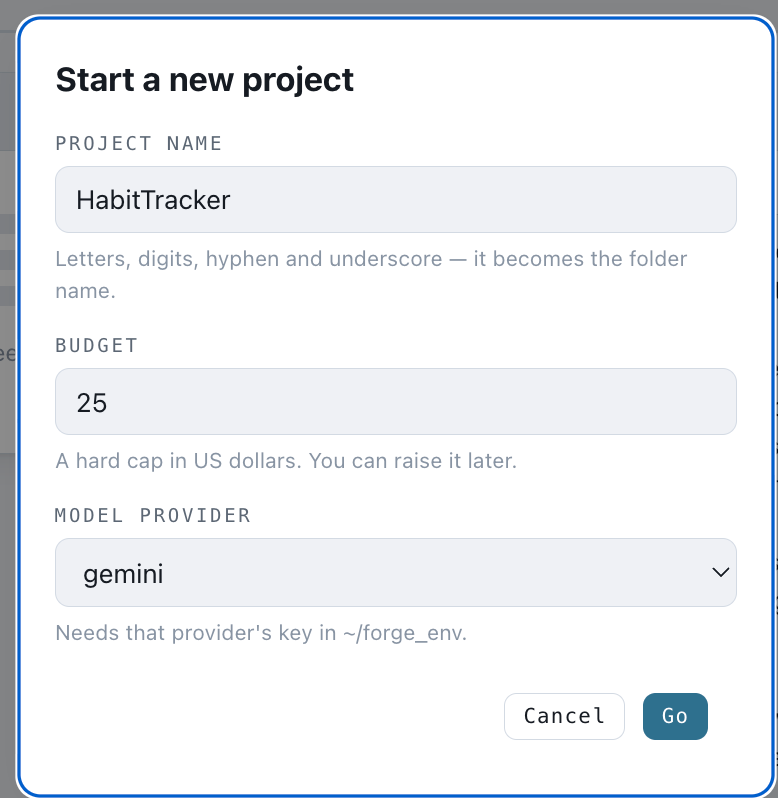
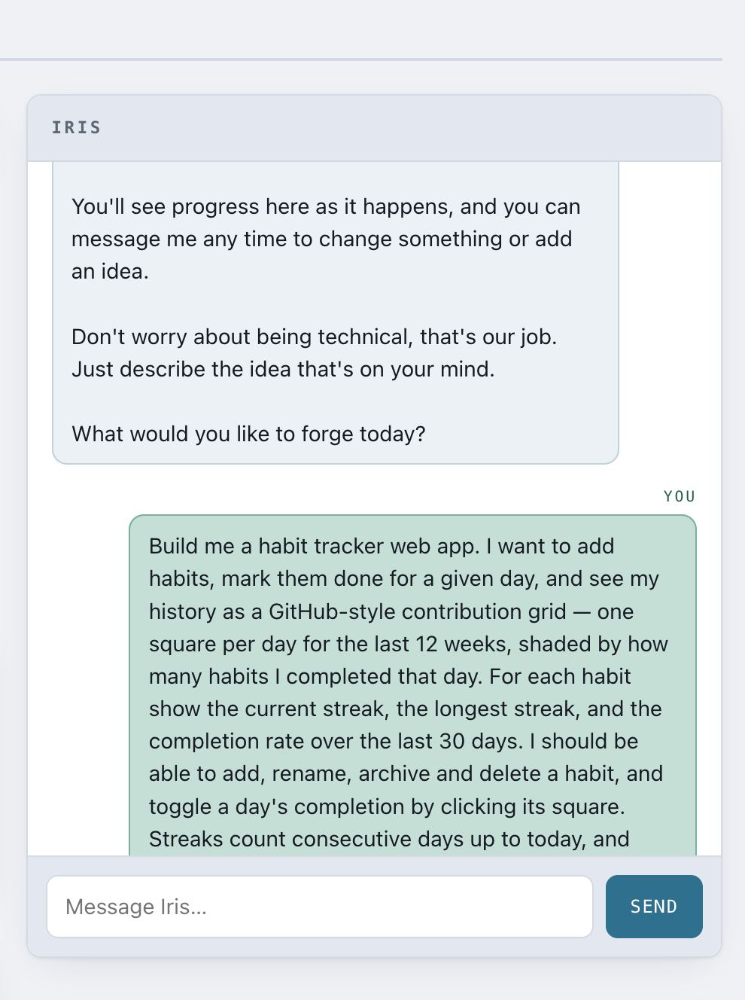
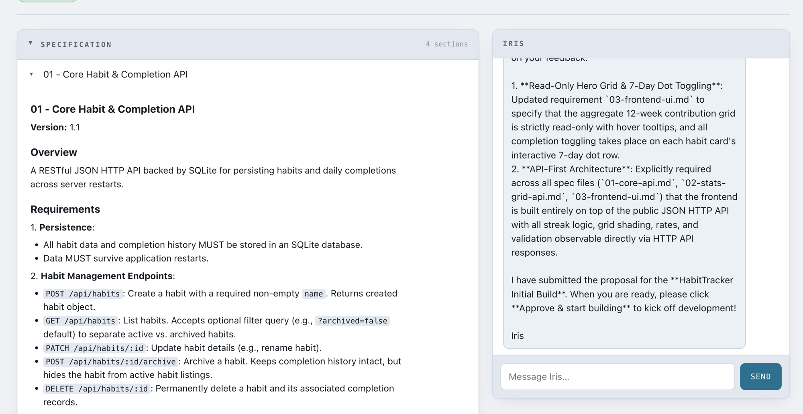
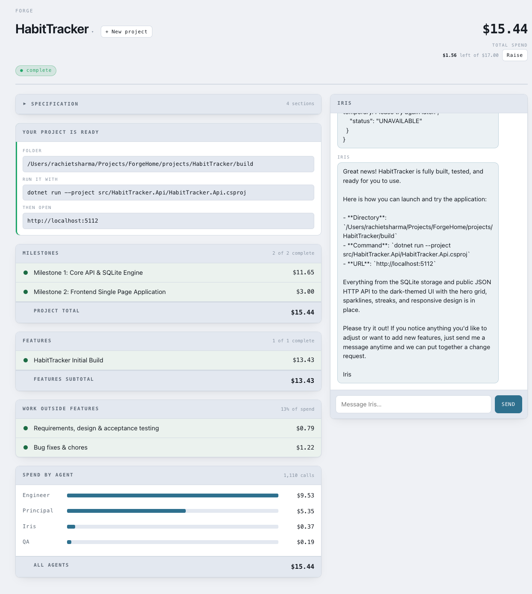
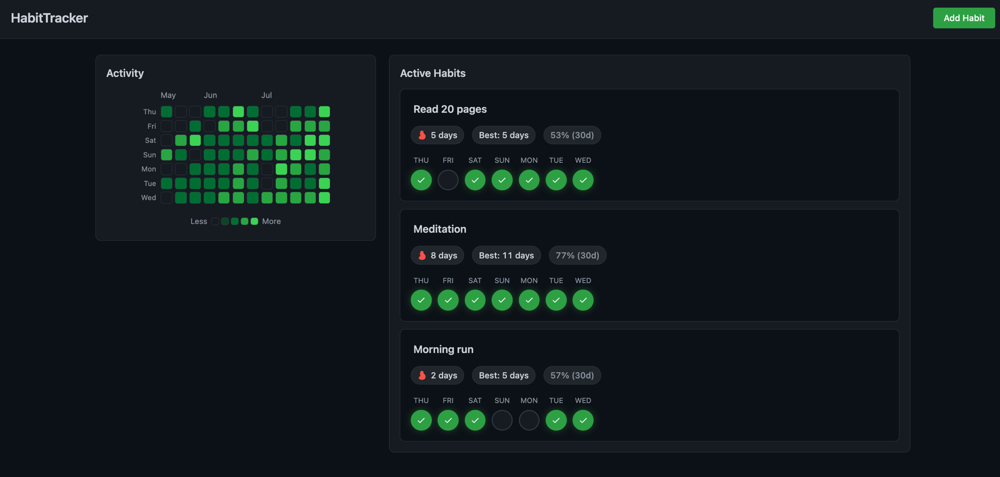

# Forge

Forge turns a plain-English idea into a working software project.

You describe what you want. A team of stateless LLM agents takes it from idea →
requirements → architecture → implementation → testing → a runnable git repo.

You only talk to one role: the **PM**.

The PM understands your idea, asks questions, and captures requirements. Once
you approve them, Forge's engineering team takes over:

- **Principal** designs the architecture and creates the task plan.
- **Engineer** agents write the code, each in an isolated workspace.
- **CI** builds and tests every change automatically, zero tokens spent.
- **Principal** reviews every diff and recovers tasks that get stuck.
- **QA** validates the finished app against the original requirements.

The result is a real project you can clone, run, and keep developing.

---

## How Forge works



**PM** — the only role you talk to. Understands the idea, asks clarifying
questions, writes the requirements, and puts them to you for approval with
`propose_requirements` — approving is what hands the project to engineering.
Later change requests go through the same chat.

**Principal** — owns technical execution: designs the structure and
contracts, breaks work into a task graph, reviews every engineer's diff, and
rescues any task that gets stuck.

**Engineer** — implements one task at a time in an isolated, jailed
workspace and submits it for review.

**QA** — once the board is drained, black-box tests the running app like a
real user and files a bug for anything that misses a requirement. Bugs flow
back through the same build loop; the project isn't done until a QA round
files nothing new.

---

## Why Forge is different

Most AI coding tools generate code. Forge is built to run an autonomous,
multi-agent build that stays honest and bounded. Detail on each of these
lives in [`ARCHITECTURE.md`](ARCHITECTURE.md).

- **Ground truth over agent claims** — merge, CI, and test state come from
  git and process output, never from what an agent says.
- **Mechanical CI** — `dotnet build`/`dotnet test` run as harness code, not
  an LLM call. The Principal never reviews a diff that fails to build.
- **One task state machine** — status drives who acts next; there's no
  separate "next actor" field that can drift out of sync.
- **Automatic recovery** — a stuck task escalates to the Principal, who
  redirects, splits, or takes it over directly.
- **Two budgets, two jobs** — a dollar project cap pauses the build for a
  money decision; a token task cap strikes a runaway agent. They're never
  conflated.
- **One LLM interface, three providers** — Claude, OpenAI, and Gemini are
  normalized behind one adapter. Recipes name a model tier, never a
  hardcoded model id.

---

## Installation

**Requirements:** .NET 8 SDK or newer (`dotnet --version`), and an API key
for Claude (default), OpenAI, or Gemini.

**API key** — create `~/forge_env`:

```sh
ANTHROPIC_API_KEY=sk-ant-api-your-key-here   # default provider
# OPENAI_API_KEY=sk-...
# GEMINI_API_KEY=...
```

```sh
chmod 600 ~/forge_env
```

This is Forge's own credential file, separate from the encrypted secrets
vault used by generated projects (below). Agents never see it. Override the
path with `FORGE_ENV`.

**Data location** — all runtime data (databases, git repos, workspaces)
lives under one root, default `~/forge-data`, override with `FORGE_HOME`.
Client project data never lives inside the Forge source tree.

**Build:**

```sh
dotnet build -c Release
alias forge='dotnet /path/to/Forge/src/Forge.Cli/bin/Release/net8.0/Forge.Cli.dll'
```

---

## Getting started

### The dashboard

```sh
forge board                # http://localhost:5177, every project
forge board --port 8080
```

**1 — Create the project.** A name, a hard cap in dollars, and a provider. The
cap is real: the build pauses when it's reached and asks you, rather than
spending on.



**2 — Describe what you want.** Iris, the PM, opens the conversation. Plain
language is enough; she asks about anything ambiguous.



**3 — Approve the specification.** Iris turns your conversation into a full
requirements and specification document, then waits for you to review it.
Once you approve, you sit back and watch: the agents start building.



**4 — Watch the agents work.** Approving starts the build, and from here it
runs itself. Milestones, features and spend per agent update as work lands,
every figure read from the token ledger rather than estimated. Check in
whenever you like, and pause or resume from the same page. When it's done,
the board tells you where the project is and how to run it.



**5 — Run what it built.**



### The CLI

The same pipeline, without the browser:

```sh
forge project init habittracker           # create it
forge chat habittracker                   # same PM conversation, in the terminal
forge run habittracker --loop             # build until the board drains, then QA
forge task list habittracker              # where everything stands
forge log habittracker --events           # every tool call, git op, transition
```

A run is autonomous but not opaque: every action is one logged line, and
`--task 3` narrows the trail to a single task.

The result is an ordinary git repo:

```sh
git clone "$FORGE_HOME/projects/habittracker/repo.git" habittracker
cd habittracker && dotnet run --project src/<ProjectName>
```

Only one build runs machine-wide at a time, so the dashboard and a terminal
`forge run` can't collide on the same database.

---

## What to build

Forge builds **.NET projects** — console tools and ASP.NET web apps, because
everything a project does must be verifiable from the CLI or over HTTP.

In the intake chat: describe the outcome, not the tech; say what you care
about (look, feel, edge cases); answer the PM's questions up front — that's
where correctness is won. You're the reviewer of the requirements; once you
approve them, the PM hands off to engineering.

---

## Limitations

- .NET only — console and ASP.NET projects.
- One build runs machine-wide at a time.
- Change requests extend a project Forge already built; there's no import of
  an existing external codebase.

---

## Commands

| Command | What it does |
|---|---|
| `forge project init <name>` | Create a project's data directory, database, and git repo. |
| `forge chat <name> [-m MSG]` | Talk to the PM: intake, requirements, status. |
| `forge run <name> [--loop] [--project-budget N] [--task ID]` | Claim and run tasks; `--loop` drains the board autonomously, then runs QA. |
| `forge task list <name>` | Show the task board. |
| `forge task add <name> <title> [options]` | Add a task by hand. |
| `forge board [--port N]` | Serve the browser dashboard (default port 5177). |
| `forge log <name> [--events] [--task N] [--domain D]` | Replay the trail and token spend. |
| `forge prices show [--project NAME]` | Show provider pricing. |
| `forge prices update` | Force a price refresh. |
| `forge secrets set\|list` | Manage a project's encrypted secrets vault. |

---

## Repository layout

```
src/
 ├── Forge.Core        # orchestrator + harness: scheduler, agent loop, tools, DB
 └── Forge.Cli         # the forge command-line interface
prompts/
 ├── roles             # versioned per-role prompts
 └── tasks             # versioned per-task-type prompts
tests/
 └── Forge.Tests
```

- [`ARCHITECTURE.md`](ARCHITECTURE.md) — how the agent loop, task state
  machine, provider adapters, and budget guardrails work in code.
- [`CLAUDE.md`](CLAUDE.md) — the engineering decisions behind that design.
