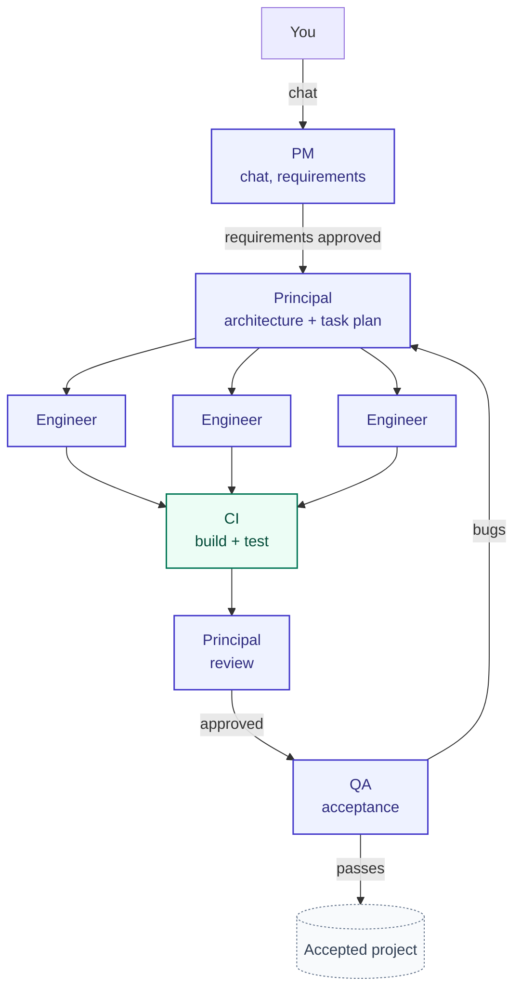

# Forge

Forge turns a plain-English idea into a working software project.

You describe what you want. A team of stateless LLM agents takes it from idea →
requirements → architecture → implementation → testing → a runnable git repo.

You only talk to one role: the **PM**.

The PM understands your idea, asks questions, and captures requirements. Once
you approve them, Forge's engineering team takes over:

- **Principal** designs the architecture and creates the task plan.
- **Engineer** agents write the code, each in an isolated workspace.
- **CI** builds and tests every change automatically, zero tokens spent.
- **Principal** reviews every diff and recovers tasks that get stuck.
- **QA** validates the finished app against the original requirements.

The result is a real project you can clone, run, and keep developing.

---

## How Forge works



**PM** — the only role you talk to. Understands the idea, asks clarifying
questions, writes the requirements, and hands the project to engineering by
calling `create_feature`. Later change requests go through the same chat.

**Principal** — owns technical execution: designs the structure and
contracts, breaks work into a task graph, reviews every engineer's diff, and
rescues any task that gets stuck.

**Engineer** — implements one task at a time in an isolated, jailed
workspace and submits it for review.

**QA** — once the board is drained, black-box tests the running app like a
real user and files a bug for anything that misses a requirement. Bugs flow
back through the same build loop; the project isn't done until a QA round
files nothing new.

---

## Example workflow

```sh
forge project init mynotes
forge chat mynotes
```

> Build me a sticky-note app. Users create, edit, delete, and move notes.
> Notes persist across restarts. The interface should feel elegant and
> handwritten.

The PM turns the conversation into requirements. Once you approve them:

```sh
forge run mynotes --loop --project-budget 1000000
```

Forge designs the app, plans the tasks, writes the code, builds and tests it,
reviews every change, runs QA, and reports back when the project is accepted.
`--project-budget` caps total token spend.

The result is an ordinary git repo:

```sh
git clone "$FORGE_HOME/projects/mynotes/repo.git" mynotes-app
cd mynotes-app
dotnet run --project src/<ProjectName>
```

---

## Why Forge is different

Most AI coding tools generate code. Forge is built to run an autonomous,
multi-agent build that stays honest and bounded. Detail on each of these
lives in [`ARCHITECTURE.md`](ARCHITECTURE.md).

- **Ground truth over agent claims** — merge, CI, and test state come from
  git and process output, never from what an agent says.
- **Mechanical CI** — `dotnet build`/`dotnet test` run as harness code, not
  an LLM call. The Principal never reviews a diff that fails to build.
- **One task state machine** — status drives who acts next; there's no
  separate "next actor" field that can drift out of sync.
- **Automatic recovery** — a stuck task escalates to the Principal, who
  redirects, splits, or takes it over directly.
- **Two budgets, two jobs** — a dollar project cap pauses the build for a
  money decision; a token task cap strikes a runaway agent. They're never
  conflated.
- **One LLM interface, three providers** — Claude, OpenAI, and Gemini are
  normalized behind one adapter. Recipes name a model tier, never a
  hardcoded model id.

---

## Installation

**Requirements:** .NET 8 SDK or newer (`dotnet --version`), and an API key
for Claude (default), OpenAI, or Gemini.

**API key** — create `~/forge_env`:

```sh
ANTHROPIC_API_KEY=sk-ant-api-your-key-here   # default provider
# OPENAI_API_KEY=sk-...
# GEMINI_API_KEY=...
```

```sh
chmod 600 ~/forge_env
```

This is Forge's own credential file, separate from the encrypted secrets
vault used by generated projects (below). Agents never see it. Override the
path with `FORGE_ENV`.

**Data location** — all runtime data (databases, git repos, workspaces)
lives under one root, default `~/forge-data`, override with `FORGE_HOME`.
Client project data never lives inside the Forge source tree.

**Build:**

```sh
dotnet build -c Release
alias forge='dotnet /path/to/Forge/src/Forge.Cli/bin/Release/net8.0/Forge.Cli.dll'
```

**Other providers** — Claude is the default. To switch, create
`<data root>/llm.json`:

```json
{ "provider": "openai" }
```

or pin a model per tier (`fast`, `coding`, `reasoning`):

```json
{ "provider": "gemini",
  "models": { "reasoning": "gemini/gemini-2.5-pro" } }
```

`FORGE_LLM_PROVIDER=openai forge run …` overrides the file for one command.
`forge prices show` confirms your provider and the live rate for every model
it will use — Forge refuses to run a model it can't price.

---

## Browser dashboard

```sh
forge board                # http://localhost:5177, every project
forge board --port 8080
```

Create projects, chat with the PM, watch milestones and spend per agent, and
start or stop the build — no terminal needed after that. Only one build runs
machine-wide at a time, so the dashboard and a terminal `forge run` can't
collide on the same database.

---

## Watching a run

```sh
forge task list mynotes                 # the board: status, budget, progress
forge log  mynotes                      # conversation + decision trail
forge log  mynotes --events             # every tool call, git op, transition
forge log  mynotes --events --task 3    # just one task
```

A run is autonomous but not opaque — every action is one logged line.

---

## What to build

Forge builds **.NET projects** — console tools and ASP.NET web apps, because
everything a project does must be verifiable from the CLI or over HTTP.

- **CLI**: expense splitter, habit tracker, unit converter, markdown formatter.
- **Web app**: sticky-note board, URL shortener, poll app, kanban board.

In the intake chat: describe the outcome, not the tech; say what you care
about (look, feel, edge cases); answer the PM's questions up front — that's
where correctness is won. You're the reviewer of the requirements; once you
approve them, the PM hands off to engineering.

---

## Limitations

- .NET only — console and ASP.NET projects.
- One build runs machine-wide at a time.
- Change requests extend a project Forge already built; there's no import of
  an existing external codebase.

---

## Commands

| Command | What it does |
|---|---|
| `forge project init <name>` | Create a project's data directory, database, and git repo. |
| `forge chat <name> [-m MSG]` | Talk to the PM: intake, requirements, status. |
| `forge run <name> [--loop] [--project-budget N] [--task ID]` | Claim and run tasks; `--loop` drains the board autonomously, then runs QA. |
| `forge task list <name>` | Show the task board. |
| `forge task add <name> <title> [options]` | Add a task by hand. |
| `forge board [--port N]` | Serve the browser dashboard (default port 5177). |
| `forge log <name> [--events] [--task N] [--domain D]` | Replay the trail and token spend. |
| `forge prices show [--project NAME]` | Show provider pricing. |
| `forge prices update` | Force a price refresh. |
| `forge secrets set\|list` | Manage a project's encrypted secrets vault. |

---

## Repository layout

```
src/
 ├── Forge.Core        # orchestrator + harness: scheduler, agent loop, tools, DB
 └── Forge.Cli         # the forge command-line interface
prompts/
 ├── roles             # versioned per-role prompts
 └── tasks             # versioned per-task-type prompts
tests/
 └── Forge.Tests
```

- [`ARCHITECTURE.md`](ARCHITECTURE.md) — how the agent loop, task state
  machine, provider adapters, and budget guardrails work in code.
- [`CLAUDE.md`](CLAUDE.md) — the engineering decisions behind that design.
